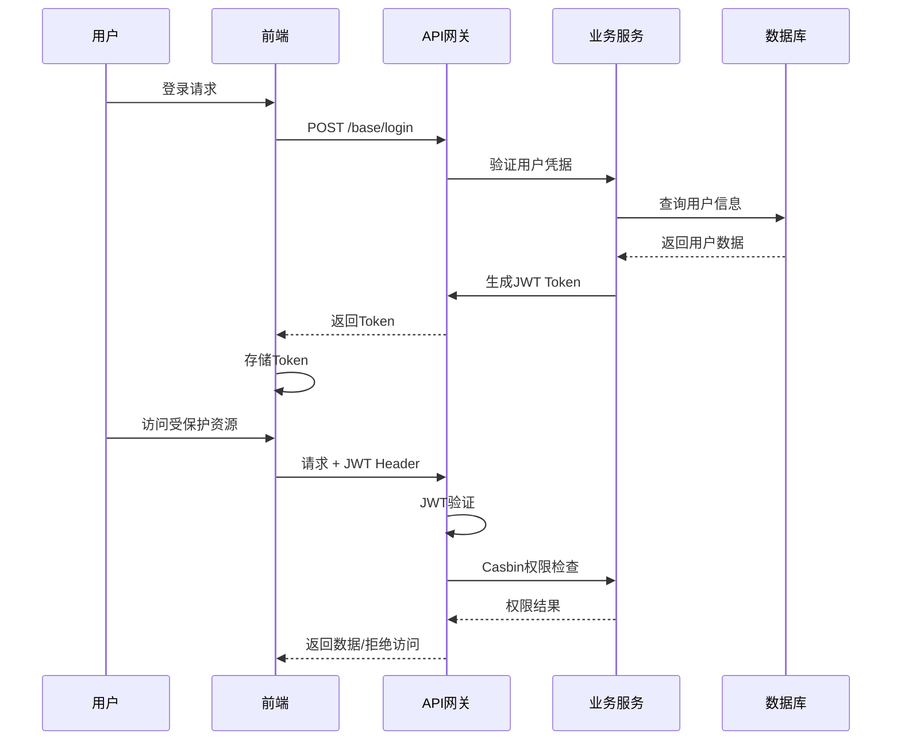

# 项目介绍

**Gin-Vue-Admin** 是一个全栈管理框架，专为快速开发Web应用程序而设计，具有完整的前后端分离架构。基于Go (Gin) 和Vue.js构建，提供了一个全面的开发平台，具备自动化代码生成、AI辅助开发和企业级安全特性。

## 🚀 快速链接

* **GitHub地址**: [https://github.com/flipped-aurora/gin-vue-admin](https://github.com/flipped-aurora/gin-vue-admin)
* **GitCode地址**: [https://gitCode.com/flipped-aurora/gin-vue-admin](https://gitCode.com/flipped-aurora/gin-vue-admin)
* **Gitee地址**: [https://gitee.com/pixelmax/gin-vue-admin](https://gitee.com/pixelmax/gin-vue-admin)
* **在线演示**: [http://demo.gin-vue-admin.com/](http://demo.gin-vue-admin.com/)
  - 用户名：`admin`
  - 密码：`123456`

## 🎯 项目定位

Gin-Vue-Admin 作为企业级管理系统的基础框架，专注于为开发者提供：

- **🚀 快速开发**: AutoCode生成系统，可在1分钟内生成完整的CRUD功能
- **🔒 企业安全**: JWT认证 + Casbin RBAC授权的双重安全保障
- **🔧 高度灵活**: 动态路由、菜单管理和API配置
- **📚 完整文档**: Swagger API文档自动生成
- **☁️ 云原生**: 多云文件存储支持(七牛云、阿里云、AWS S3)
- **🗄️ 多数据库**: 支持MySQL、PostgreSQL、SQLite和MSSQL

该系统主要面向构建管理后台、内容管理系统和需要用户管理及权限控制的业务应用的开发者。


## 🛠️ 技术栈

::: warning 环境要求
- **Node.js**: ≥ 18.16.2
- **Go**: ≥ 1.22
- **MySQL**: ≥ 5.7 (引擎必须为 InnoDB)
- **Git**: 版本控制工具

推荐使用 Docker 创建 MySQL 数据库以确保环境一致性
:::

### 前端技术栈

| 技术 | 版本 | 描述 |
|------|------|------|
| **Vue.js** | 3.3.4 | 渐进式JavaScript框架 |
| **Element Plus** | 2.3.8 | Vue 3 UI组件库 |
| **Pinia** | Latest | 状态管理(替代Vuex) |
| **Vue Router** | Latest | SPA路由与动态路由 |
| **Vite** | Latest | 构建工具和开发服务器 |

### 后端技术栈

| 技术 | 版本 | 描述 |
|------|------|------|
| **Go** | ≥ 1.22 | 编程语言 |
| **Gin** | 1.9.1 | 高性能Web框架 |
| **GORM** | 1.25.2 | ORM库，支持自动迁移 |
| **Casbin** | Latest | 访问控制库(RBAC) |

### 数据库支持

| 数据库 | 版本要求 | 说明 |
|--------|----------|------|
| **MySQL** | ≥ 5.7 | 主数据库，InnoDB引擎 |
| **PostgreSQL** | ≥ 9.6 | 关系型数据库替代方案 |
| **SQLite** | Latest | 嵌入式数据库选项 |
| **MS SQL Server** | Latest | 微软数据库支持 |
| **Oracle** | Latest | 企业级数据库支持 |

### 缓存与存储

- **Redis**: 缓存和会话管理
- **七牛云**: 对象存储服务
- **阿里云OSS**: 阿里巴巴云存储
- **AWS S3**: 亚马逊Web服务存储

### 开发工具

- **Swagger**: API文档自动生成
- **Viper**: 配置管理
- **Zap**: 结构化日志记录
- **fsnotify**: 文件系统通知

### AI集成

- **LLM APIs**: AI辅助代码生成
- **MCP Protocol**: 模型上下文协议，用于AI代理

## 🌟 核心功能

### 🔐 安全认证系统
- **JWT认证**: 无状态的用户身份验证
- **Casbin RBAC**: 基于角色的访问控制
- **多点登录控制**: 支持单点登录限制
- **API权限管理**: 细粒度的接口访问控制

### 👥 用户权限管理
- **用户管理**: 系统管理员分配用户角色和权限
- **角色管理**: 创建权限控制对象，支持API、菜单、按钮权限分配
- **菜单管理**: 动态菜单配置，实现不同角色不同菜单
- **按钮权限**: 页面级别的操作权限控制

### 🚀 快速开发工具
- **AutoCode生成器**: 1分钟生成完整CRUD功能的代码生成器
- **表单生成器**: 基于 [Variant Form](https://www.vform666.com/) 的可视化表单设计
- **API自动文档**: Swagger自动生成API文档
- **RESTful示例**: 标准的RESTful API设计参考

### 📁 文件存储系统
- **多云存储**: 支持本地、七牛云、阿里云、腾讯云存储
- **分片上传**: 大文件分片上传功能
- **断点续传**: 文件上传中断后可继续上传
- **文件管理**: 完整的文件上传下载管理

### 🔧 系统管理
- **配置管理**: 前台可视化配置文件修改
- **日志管理**: 系统操作日志记录和查询
- **监控面板**: 系统运行状态监控
- **数据字典**: 系统数据字典管理

### 🎨 用户界面
- **富文本编辑器**: 内置MarkDown编辑器
- **条件搜索**: 高级搜索功能示例
- **数据导入导出**: Excel数据处理功能
- **响应式设计**: 适配多种设备屏幕

### 🔌 插件生态
- **插件中心** <Badge type="tip" text="NEW" class="bg-indigo-600 font-medium dark:bg-indigo-500" />: 基于GVA设计的Go插件中心
- **微信集成**: 微信支付、登录等功能插件
- **K8s操作**: Kubernetes相关操作插件
- **第三方登录**: 多种第三方登录方式支持

## 如何贡献

在以任何形式的参与前，请先阅读开发指南。如有任何的意见或建议，欢迎您通过创建 [Issue](https://github.com/flipped-aurora/gin-vue-admin/issues)或 [PR](https://github.com/flipped-aurora/gin-vue-admin/pulls)的方式告知我们。也可以选择gva [官方讨论组](https://plugin.gin-vue-admin.com/#/layout/vip)
::: warning 🧁
强烈推荐阅读 [《提问的智慧》](https://github.com/ryanhanwu/How-To-Ask-Questions-The-Smart-Way) 和 [《如何向开源社区提问题》](https://github.com/seajs/seajs/issues/545) ，更好的问题更容易获得帮助。
:::

## 🏗️ 系统架构

### 整体架构设计

Gin-Vue-Admin 采用现代化的前后端分离架构，通过清晰的分层设计确保系统的可维护性和扩展性：

```
┌─────────────────┐    ┌─────────────────┐    ┌─────────────────┐
│   前端层 (Vue)   │    │   后端层 (Go)    │    │    数据层 (DB)   │
├─────────────────┤    ├─────────────────┤    ├─────────────────┤
│ • Vue 3 + Vite  │    │ • Gin Framework │    │ • MySQL/PG/...  │
│ • Element Plus  │◄──►│ • JWT + Casbin  │◄──►│ • Redis Cache   │
│ • Pinia Store   │    │ • GORM ORM      │    │ • File Storage  │
│ • Vue Router    │    │ • Swagger Docs  │    │ • Cloud Storage │
└─────────────────┘    └─────────────────┘    └─────────────────┘
```

### 系统架构图


### 核心架构组件

#### 🎨 前端架构 (Vue.js + Vite)
- **应用启动**: `main.js` - 应用程序引导
- **路由系统**: Vue Router - 动态路由管理
- **状态管理**: Pinia Stores - 全局状态管理
- **布局系统**: Header, Aside, Tabs - 页面布局组件
- **权限控制**: 菜单权限、API权限、按钮权限
- **组件库**: Upload, Select, Export - 通用业务组件

#### ⚙️ 后端架构 (Go + Gin)
- **服务启动**: `main.go` - 服务器引导程序
- **配置系统**: `core.Viper` - 配置管理系统
- **认证中间件**: `middleware.JWT` - JWT身份验证
- **授权中间件**: `middleware.Casbin` - 权限控制处理
- **API处理器**: `api.v1` - REST API处理程序
- **业务服务**: `service.*` - 业务逻辑服务
- **代码生成**: `service.AutoCode` - 自动代码生成引擎

#### 🗄️ 数据架构
- **主数据库**: `global.GVA_DB` - 主要数据存储
- **缓存系统**: `global.GVA_REDIS` - 缓存和会话
- **文件存储**: 本地/云端对象存储服务
- **权限存储**: `system.CasbinRule` - 策略存储

### 认证授权流程



### 前端详细设计图

*提供者: <a href="https://github.com/baobeisuper">baobeisuper</a>*


### 初始化流程

系统启动时的初始化顺序确保了各组件的正确加载：

1. **配置初始化**: `core.Viper` - 加载配置文件
2. **日志初始化**: `core.Zap` - 设置日志系统
3. **数据库连接**: `initialize.Gorm` - 建立数据库连接
4. **数据表注册**: `initialize.RegisterTables` - 注册数据模型
5. **Redis连接**: `initialize.Redis` - 建立缓存连接
6. **路由初始化**: `initialize.Routers` - 设置API路由
7. **服务启动**: `core.RunWindowsServer` - 启动HTTP服务
