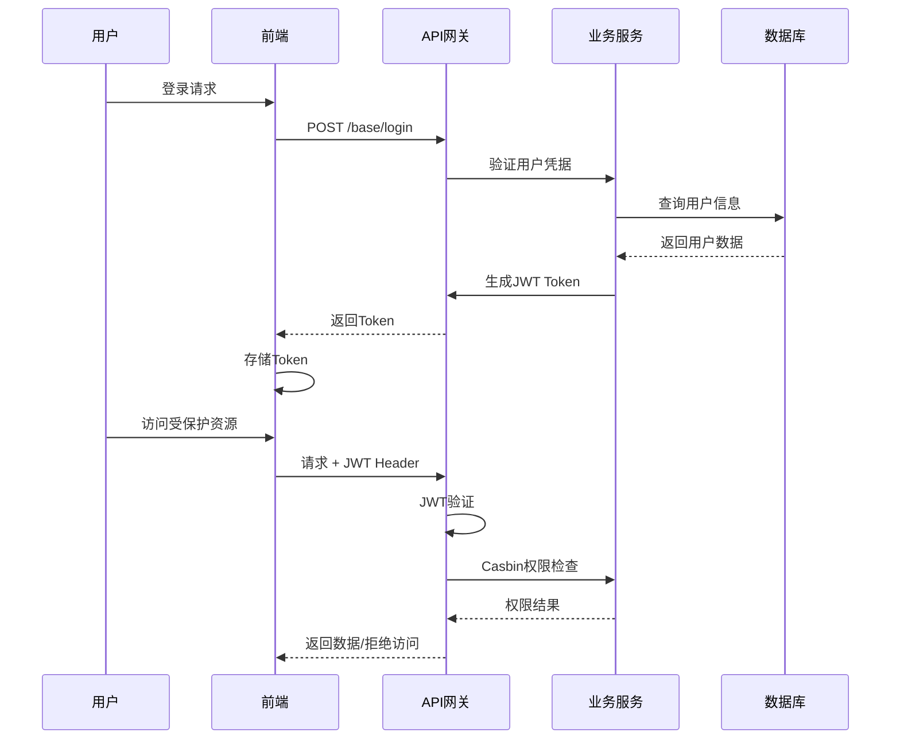

# 项目介绍

**Gin-Vue-Admin** 是一个全栈管理框架，专为快速开发Web应用程序而设计，具有完整的前后端分离架构。基于Go (Gin) 和Vue.js构建，提供了一个全面的开发平台，具备自动化代码生成、AI辅助开发和企业级安全特性。

## 快速链接

- **GitHub 地址**

  [https://github.com/flipped-aurora/gin-vue-admin](https://github.com/flipped-aurora/gin-vue-admin)
- **GitCode 地址**

  [https://gitCode.com/flipped-aurora/gin-vue-admin](https://gitCode.com/flipped-aurora/gin-vue-admin)
- **Gitee 地址**

  [https://gitee.com/pixelmax/gin-vue-admin](https://gitee.com/pixelmax/gin-vue-admin)
- **在线演示** 用户名：`admin` 密码：`123456`

  [http://demo.gin-vue-admin.com/](http://demo.gin-vue-admin.com/)

## 项目定位

Gin-Vue-Admin 作为企业级管理系统的基础框架，专注于为开发者提供：

- **快速开发**: AutoCode生成系统，可在1分钟内生成完整的CRUD功能
- **企业安全**: JWT认证 + Casbin RBAC授权的双重安全保障
- **高度灵活**: 动态路由、菜单管理和API配置
- **完整文档**: Swagger API文档自动生成
- **云原生**: 多云文件存储支持(本地、七牛、阿里、腾讯、华为、AWS S3、Cloudflare R2、MinIO)
- **多数据库**: 支持MySQL、PostgreSQL、SQLite和MSSQL

该系统主要面向构建管理后台、内容管理系统和需要用户管理及权限控制的业务应用的开发者。

## 技术栈

::: warning 环境要求
- **Node.js**: ≥ 20.19 或 ≥ 22.12
- **Go**: ≥ 1.24
- **MySQL**: ≥ 5.7 (引擎必须为 InnoDB，推荐 8.0)
- **Git**: 版本控制工具

推荐使用 Docker 创建 MySQL 数据库以确保环境一致性
:::

### 前端技术栈

| 技术 | 版本 | 描述 |
|------|------|------|
| **Vue.js** | ^3.5.31 | 渐进式JavaScript框架 |
| **Element Plus** | ^2.13.6 | Vue 3 UI组件库 |
| **Pinia** | ^2 | 状态管理(替代Vuex) |
| **Vue Router** | ^4 | SPA路由与动态路由 |
| **Vite** | ^8 | 构建工具和开发服务器 |
| **UnoCSS** | 66 | 原子化CSS引擎(基于presetWind3) |
| **reka-ui** | ^2.10.0 | 无样式基础组件库(g- 前缀全局注册) |

### 后端技术栈

| 技术 | 版本 | 描述 |
|------|------|------|
| **Go** | ≥ 1.24 | 编程语言 |
| **Gin** | v1.10.0 | 高性能Web框架 |
| **GORM** | v1.31.1 | ORM库，支持自动迁移 |
| **Casbin** | v3.10.0 | 访问控制库(RBAC) |

### 数据库支持

| 数据库 | 版本要求 | 说明 |
|--------|----------|------|
| **MySQL** | ≥ 5.7 | 主数据库，InnoDB引擎 |
| **PostgreSQL** | ≥ 9.6 | 关系型数据库替代方案 |
| **SQLite** | Latest | 嵌入式数据库选项 |
| **MS SQL Server** | Latest | 微软数据库支持 |
| **Oracle** | Latest | 企业级数据库支持 |

### 缓存与存储

- **GVA_CACHE**: 统一缓存抽象，根据配置自动选择 Memory/Redis 实现，JWT黑名单、验证码、限流计数均已迁入
- **多云对象存储**: 支持本地、七牛云、阿里云、腾讯云、华为云、AWS S3、Cloudflare R2、MinIO 共 8 种存储方式

### 开发工具

- **Swagger**: API文档自动生成
- **Viper**: 配置管理
- **Zap**: 结构化日志记录
- **fsnotify**: 文件系统通知

### AI集成

- **API 一键生成 CLI**: 将 API 一键生成为 CLI 命令行工具
- **MCP 工具与场景编排**: MCP Tool/API 管理与场景编排，供 AI 代理调用
- **AI 辅助代码生成**: AI 辅助生成业务代码，支持 AI 页面流式输出

## 核心功能

### 安全认证系统

- **JWT认证**: 无状态的用户身份验证
- **Casbin RBAC**: 基于角色的访问控制
- **多点登录控制**: 支持单点登录限制
- **API权限管理**: 细粒度的接口访问控制

### 安全中心

- **登录保护**: 登录失败锁定、登录/IP 限流
- **密码策略**: 密码复杂度校验、密码过期与强制改密
- **API Token**: 开放接口令牌管理
- **登录日志**: 登录行为记录与审计

### 用户权限管理

- **用户管理**: 系统管理员分配用户角色和权限
- **角色管理**: 创建权限控制对象，支持API、菜单、按钮权限分配
- **菜单管理**: 动态菜单配置，实现不同角色不同菜单
- **按钮权限**: 页面级别的操作权限控制

### 组织与数据权限

- **部门管理**: 组织架构与部门维护
- **岗位管理**: 岗位信息维护
- **数据权限**: 基于角色的数据范围控制，支持 5 档数据范围

### 快速开发工具

- **AutoCode生成器**: 1分钟生成完整CRUD功能的代码生成器
- **表单生成器**: 基于 [Variant Form](https://www.vform666.com/) 的可视化表单设计
- **API自动文档**: Swagger自动生成API文档
- **RESTful示例**: 标准的RESTful API设计参考

### 文件存储系统

- **多云存储**: 支持本地、七牛云、阿里云、腾讯云、华为云、AWS S3、Cloudflare R2、MinIO 共 8 种存储
- **分片上传**: 大文件分片上传功能
- **断点续传**: 文件上传中断后可继续上传
- **文件管理**: 完整的文件上传下载管理

### 媒体库

- **媒体管理**: 独立的媒体资源库，统一管理上传文件
- **大文件上传**: 支持大文件分片上传、断点续传与秒传

### 系统管理

- **配置管理**: 前台可视化配置文件修改
- **日志管理**: 系统操作日志记录和查询
- **监控面板**: 系统运行状态监控
- **数据字典**: 系统数据字典管理

### 定时任务

- **数据库持久化**: 任务配置持久化到数据库，服务重启后自动恢复
- **双执行器**: 支持 method 与 http 两种任务执行方式

### 用户界面

- **富文本编辑器**: 内置MarkDown编辑器
- **条件搜索**: 高级搜索功能示例
- **数据导入导出**: Excel数据处理功能
- **响应式设计**: 适配多种设备屏幕

### 主题系统

- **主题自定义**: 主题色、语义色、圆角、卡片模式、菜单风格、标签栏模式、布局模式自定义
- **官方预设**: GVA-科技蓝、GVA 经典蓝、Azir-清新蓝、暗夜深色，支持预设导入导出
- **后台布局**: 5 种布局模式(经典 normal、顶部导航 head、混合 combination、侧栏常驻 sidebar、通栏侧边 vertical)，移动端 Drawer 适配
- **基础组件库**: 基于 reka-ui 的 g- 前缀全局基础组件

### 插件生态

- **插件中心** <Badge type="tip" text="NEW" />: 基于GVA设计的Go插件中心
- **微信集成**: 微信支付、登录等功能插件
- **K8s操作**: Kubernetes相关操作插件
- **第三方登录**: 多种第三方登录方式支持

## 如何贡献

在以任何形式的参与前，请先阅读开发指南。如有任何的意见或建议，欢迎您通过创建 [Issue](https://github.com/flipped-aurora/gin-vue-admin/issues)或 [PR](https://github.com/flipped-aurora/gin-vue-admin/pulls)的方式告知我们。也可以选择gva [官方讨论组](https://plugin.gin-vue-admin.com/#/layout/vip)

::: warning
强烈推荐阅读 [《提问的智慧》](https://github.com/ryanhanwu/How-To-Ask-Questions-The-Smart-Way) 和 [《如何向开源社区提问题》](https://github.com/seajs/seajs/issues/545) ，更好的问题更容易获得帮助。
:::

## 系统架构

### 整体架构设计

Gin-Vue-Admin 采用现代化的前后端分离架构，通过清晰的分层设计确保系统的可维护性和扩展性：

```
┌─────────────────┐    ┌─────────────────┐    ┌─────────────────┐
│   前端层 (Vue)   │    │   后端层 (Go)    │    │    数据层 (DB)   │
├─────────────────┤    ├─────────────────┤    ├─────────────────┤
│ • Vue 3 + Vite  │    │ • Gin Framework │    │ • MySQL/PG/...  │
│ • Element Plus  │◄──►│ • JWT + Casbin  │◄──►│ • Redis Cache   │
│ • Pinia Store   │    │ • GORM ORM      │    │ • File Storage  │
│ • Vue Router    │    │ • Swagger Docs  │    │ • Cloud Storage │
└─────────────────┘    └─────────────────┘    └─────────────────┘
```

### 系统架构图


### 核心架构组件

#### 前端架构 (Vue.js + Vite)

- **应用启动**: `main.js` - 应用程序引导
- **路由系统**: Vue Router - 动态路由管理
- **状态管理**: Pinia Stores - 全局状态管理
- **布局系统**: Header, Aside, Tabs - 页面布局组件
- **权限控制**: 菜单权限、API权限、按钮权限
- **组件库**: Upload, Select, Export - 通用业务组件

#### 后端架构 (Go + Gin)

- **服务启动**: `main.go` - 服务器引导程序
- **配置系统**: `core.Viper` - 配置管理系统
- **认证中间件**: `middleware.JWT` - JWT身份验证
- **授权中间件**: `middleware.Casbin` - 权限控制处理
- **API处理器**: `api.v1` - REST API处理程序
- **业务服务**: `service.*` - 业务逻辑服务
- **代码生成**: `service.AutoCode` - 自动代码生成引擎

#### 数据架构

- **主数据库**: `global.GVA_DB` - 主要数据存储
- **缓存系统**: `global.GVA_CACHE` - 统一缓存抽象(Memory/Redis 自动选择，`global.GVA_REDIS` 为 Redis 客户端)
- **文件存储**: 本地/云端对象存储服务
- **权限存储**: `system.CasbinRule` - 策略存储

### 认证授权流程


```mermaid
sequenceDiagram
    participant U as 用户
    participant F as 前端
    participant A as API网关
    participant S as 业务服务
    participant D as 数据库
    
    U->>F: 登录请求
    F->>A: POST /base/login
    A->>S: 验证用户凭据
    S->>D: 查询用户信息
    D-->>S: 返回用户数据
    S->>A: 生成JWT Token
    A-->>F: 返回Token
    F->>F: 存储Token
    
    U->>F: 访问受保护资源
    F->>A: 请求 + JWT Header
    A->>A: JWT验证
    A->>S: Casbin权限检查
    S-->>A: 权限结果
    A-->>F: 返回数据/拒绝访问
```

### 详细设计图

*提供者: [baobeisuper](https://github.com/baobeisuper)*


### 初始化流程

系统启动时的初始化顺序确保了各组件的正确加载：

1. **配置初始化**: `core.Viper` - 加载配置文件
2. **日志初始化**: `core.Zap` - 设置日志系统
3. **数据库连接**: `initialize.Gorm` - 建立数据库连接
4. **数据表注册**: `initialize.RegisterTables` - 注册数据模型
5. **Redis连接**: `initialize.Redis` - 建立缓存连接
6. **路由初始化**: `initialize.Routers` - 设置API路由
7. **服务启动**: `core.RunServer` - 跨平台启动HTTP服务

<style scoped>
:global(:root) {
  --gva-primary: #2264f2;
  --gva-primary-hover: #1b52d4;
  --gva-primary-soft: rgba(34, 100, 242, 0.1);
  --gva-success: #16a34a;
  --gva-amber: #f59e0b;
  --gva-amber-strong: #b45309;

  --gva-title: #1a1a1a;
  --gva-text-strong: #0b0b0f;
  --gva-text-body: #5a5f6b;
  --gva-text-muted: #8a8f99;

  --gva-bg-base: #ffffff;
  --gva-bg-alt: #f7f7f7;

  --gva-border: rgba(15, 23, 42, 0.1);
  --gva-border-soft: rgba(15, 23, 42, 0.06);
  --gva-border-strong: rgba(15, 23, 42, 0.16);

  --gva-shadow-sm:
    0 1px 2px rgba(15, 23, 42, 0.04),
    0 4px 12px rgba(15, 23, 42, 0.05);

  --gva-shadow:
    0 8px 24px rgba(15, 23, 42, 0.06),
    0 2px 8px rgba(15, 23, 42, 0.04);

  --gva-font:
    "MiSans", "PingFang SC", "Microsoft YaHei", -apple-system,
    BlinkMacSystemFont, "Segoe UI", Roboto, "Helvetica Neue", Arial,
    sans-serif;

  --gva-mono:
    "SF Mono", "JetBrains Mono", "Fira Code", ui-monospace,
    SFMono-Regular, Menlo, Consolas, monospace;
}

h1,
h2,
h3,
h4,
p,
li,
table,
.custom-block {
  font-family: var(--gva-font);
}

h1 {
  margin: 0 0 22px;
  padding: 0;
  border: 0;
  color: var(--gva-title);
  font-size: clamp(30px, 4vw, 40px);
  font-weight: 700;
  line-height: 1.18;
  letter-spacing: -0.02em;
}

h2 {
  margin: 44px 0 22px;
  padding: 24px 0 0;
  border-top: 1px solid var(--gva-border);
  color: var(--gva-text-strong);
  font-size: clamp(22px, 2.4vw, 27px);
  font-weight: 700;
  line-height: 1.25;
  letter-spacing: -0.02em;
}

h3 {
  margin: 34px 0 16px;
  color: var(--gva-text-strong);
  font-size: 20px;
  font-weight: 700;
  line-height: 1.35;
  letter-spacing: -0.01em;
}

h4 {
  margin: 28px 0 14px;
  color: var(--gva-text-strong);
  font-size: 17px;
  font-weight: 600;
  line-height: 1.4;
}

p,
li {
  color: var(--gva-text-body);
  font-size: 16px;
  line-height: 1.8;
}

p {
  max-width: 68ch;
}

strong {
  color: var(--gva-text-strong);
  font-weight: 600;
}

a {
  color: var(--gva-primary);
  text-decoration-color: rgba(34, 100, 242, 0.32);
  text-underline-offset: 3px;
  transition:
    color 0.15s ease,
    text-decoration-color 0.15s ease;
}

a:hover {
  color: var(--gva-primary-hover);
  text-decoration-color: currentColor;
}

code {
  border-radius: 6px;
  background: rgba(15, 23, 42, 0.06);
  color: var(--gva-text-strong);
  font-family: var(--gva-mono);
  font-size: 0.88em;
}

/* 快速链接 */

#快速链接 + ul {
  display: grid;
  grid-template-columns: repeat(2, minmax(0, 1fr));
  gap: 16px;
  margin: 0;
  padding: 0;
  list-style: none;
}

#快速链接 + ul > li {
  position: relative;
  display: flex;
  min-width: 0;
  height: 132px;
  flex-direction: column;
  margin: 0;
  padding: 18px 20px;
  border: 1px solid var(--gva-border);
  border-radius: 14px;
  background: var(--gva-bg-base);
  box-shadow: var(--gva-shadow-sm);
  list-style: none;
  transition:
    transform 0.2s ease,
    border-color 0.15s ease,
    box-shadow 0.2s ease;
}

/* 清除全局 .gva-doc 列表圆点（.vp-doc ul>li::before）在这四个卡片上的残留——卡片不需要圆点 */
#快速链接 + ul > li::before {
  display: none;
}

#快速链接 + ul > li:hover {
  transform: translateY(-3px);
  border-color: var(--gva-border-strong);
  box-shadow: var(--gva-shadow);
}

#快速链接 + ul > li > p {
  max-width: none;
  margin: 0;
}

#快速链接 + ul > li > p:first-child {
  display: flex;
  min-height: 38px;
  align-items: center;
  padding: 0 24px 0 56px;
  white-space: nowrap;
}

#快速链接 + ul > li > p:first-child > strong {
  color: var(--gva-text-strong);
  font-size: 15px;
  font-weight: 600;
  line-height: 1.3;
}

#快速链接 + ul > li > p:first-child > strong::before {
  position: absolute;
  top: 18px;
  left: 20px;
  width: 38px;
  height: 38px;
  border-radius: 10px;
  background: var(--gva-primary-soft);
  content: "";
}

#快速链接 + ul > li > p:first-child > strong::after {
  position: absolute;
  top: 29px;
  left: 31px;
  width: 16px;
  height: 16px;
  background: var(--gva-primary);
  content: "";
  mask-position: center;
  mask-repeat: no-repeat;
  mask-size: contain;
}

#快速链接 + ul > li:nth-child(-n + 3) > p:first-child > strong::after {
  mask-image: url("data:image/svg+xml,%3Csvg xmlns='http://www.w3.org/2000/svg' viewBox='0 0 24 24'%3E%3Cg fill='none' stroke='black' stroke-width='2' stroke-linecap='round' stroke-linejoin='round'%3E%3Ccircle cx='6' cy='18' r='3'/%3E%3Ccircle cx='18' cy='6' r='3'/%3E%3Cpath d='M6 15V6m0 9c0-3 2-5 5-5h4'/%3E%3C/g%3E%3C/svg%3E");
}

#快速链接 + ul > li:nth-child(4) > p:first-child > strong::after {
  mask-image: url("data:image/svg+xml,%3Csvg xmlns='http://www.w3.org/2000/svg' viewBox='0 0 24 24'%3E%3Cg fill='none' stroke='black' stroke-width='2' stroke-linecap='round' stroke-linejoin='round'%3E%3Ccircle cx='12' cy='12' r='9'/%3E%3Cpath d='M3 12h18M12 3c3 3 4 6 4 9s-1 6-4 9M12 3c-3 3-4 6-4 9s1 6 4 9'/%3E%3C/g%3E%3C/svg%3E");
}

#快速链接 + ul > li::after {
  position: absolute;
  top: 23px;
  right: 20px;
  width: 16px;
  height: 16px;
  background: var(--gva-text-muted);
  content: "";
  mask-image: url("data:image/svg+xml,%3Csvg xmlns='http://www.w3.org/2000/svg' viewBox='0 0 24 24'%3E%3Cg fill='none' stroke='black' stroke-width='2.2' stroke-linecap='round' stroke-linejoin='round'%3E%3Cpath d='M7 17 17 7M8 7h9v9'/%3E%3C/g%3E%3C/svg%3E");
  mask-position: center;
  mask-repeat: no-repeat;
  mask-size: contain;
  transition:
    background 0.15s ease,
    transform 0.2s ease;
}

#快速链接 + ul > li:hover::after {
  transform: translate(2px, -2px);
  background: var(--gva-primary);
}

#快速链接 + ul > li > p:last-child {
  margin-top: auto;
  overflow-wrap: anywhere;
  font-family: var(--gva-mono);
  font-size: 13px;
  line-height: 1.55;
}

#快速链接 + ul > li > p:last-child a {
  color: var(--gva-text-muted);
  text-decoration: none;
}

#快速链接 + ul > li:hover > p:last-child a {
  color: var(--gva-text-body);
}

#快速链接 + ul > li:nth-child(4) > p:first-child {
  font-size: 0;
}

#快速链接 + ul > li:nth-child(4) code {
  position: relative;
  display: inline-flex;
  align-items: center;
  margin-left: 34px;
  padding: 4px 9px;
  border-radius: 8px;
  background: var(--gva-primary-soft);
  color: var(--gva-primary);
  font-family: var(--gva-mono);
  font-size: 13px;
  font-weight: 500;
  line-height: 1.2;
}

#快速链接 + ul > li:nth-child(4) code::before {
  position: absolute;
  left: -25px;
  width: 16px;
  height: 16px;
  background: var(--gva-text-muted);
  content: "";
  mask-position: center;
  mask-repeat: no-repeat;
  mask-size: contain;
}

#快速链接 + ul > li:nth-child(4) code:first-of-type::before {
  mask-image: url("data:image/svg+xml,%3Csvg xmlns='http://www.w3.org/2000/svg' viewBox='0 0 24 24'%3E%3Cg fill='none' stroke='black' stroke-width='2' stroke-linecap='round' stroke-linejoin='round'%3E%3Ccircle cx='12' cy='8' r='4'/%3E%3Cpath d='M4 21a8 8 0 0 1 16 0'/%3E%3C/g%3E%3C/svg%3E");
}

#快速链接 + ul > li:nth-child(4) code:nth-of-type(2)::before {
  mask-image: url("data:image/svg+xml,%3Csvg xmlns='http://www.w3.org/2000/svg' viewBox='0 0 24 24'%3E%3Cg fill='none' stroke='black' stroke-width='2' stroke-linecap='round' stroke-linejoin='round'%3E%3Crect x='4' y='10' width='16' height='11' rx='2'/%3E%3Cpath d='M8 10V7a4 4 0 0 1 8 0v3'/%3E%3C/g%3E%3C/svg%3E");
}

/* 表格 */

table {
  display: table;
  width: 100%;
  margin: 18px 0 28px;
  overflow: hidden;
  border: 1px solid var(--gva-border);
  border-radius: 14px;
  border-collapse: separate;
  border-spacing: 0;
  box-shadow: var(--gva-shadow-sm);
  font-size: 13.5px;
  line-height: 1.6;
}

th {
  padding: 12px 14px;
  border: 0;
  border-bottom: 1px solid var(--gva-border);
  background: var(--gva-bg-alt);
  color: var(--gva-text-strong);
  font-weight: 600;
  text-align: left;
}

td {
  padding: 11px 14px;
  border: 0;
  border-bottom: 1px solid var(--gva-border-soft);
  background: var(--gva-bg-base);
  color: var(--gva-text-body);
  vertical-align: top;
}

tr:last-child td {
  border-bottom: 0;
}

tbody tr:hover td {
  background: rgba(34, 100, 242, 0.03);
}

/* 提示模块 */

.custom-block.warning {
  margin: 20px 0 28px;
  padding: 15px 18px;
  border: 1px solid var(--gva-border);
  border-left: 3px solid var(--gva-amber);
  border-radius: 12px;
  background: rgba(245, 158, 11, 0.1);
  color: var(--gva-text-body);
}

.custom-block.warning .custom-block-title {
  margin: 0 0 7px;
  color: var(--gva-amber-strong);
  font-size: 14px;
  font-weight: 600;
}

.custom-block.warning p {
  margin: 0;
  color: var(--gva-text-body);
  font-size: 14.5px;
  line-height: 1.75;
}

.custom-block.warning li {
  color: var(--gva-text-body);
  font-size: 14.5px;
  line-height: 1.75;
}

/* 代码块 */

div[class*="language-"] {
  overflow: hidden;
  border: 1px solid var(--gva-border);
  border-radius: 12px;
  background: var(--gva-bg-base);
  box-shadow: none;
}

div[class*="language-"] pre,
div[class*="language-"] code {
  font-family: var(--gva-mono);
  font-size: 14px;
  line-height: 1.75;
}

/* 图片 */

p > img {
  display: block;
  width: 100%;
  margin: 18px 0 28px;
  overflow: hidden;
  border: 1px solid var(--gva-border);
  border-radius: 14px;
  background: var(--gva-bg-alt);
  box-shadow: var(--gva-shadow-sm);
}

@media (max-width: 720px) {
  #快速链接 + ul {
    grid-template-columns: 1fr;
  }

  #快速链接 + ul > li:nth-child(4) > p:first-child {
    padding-right: 18px;
  }
}
</style>