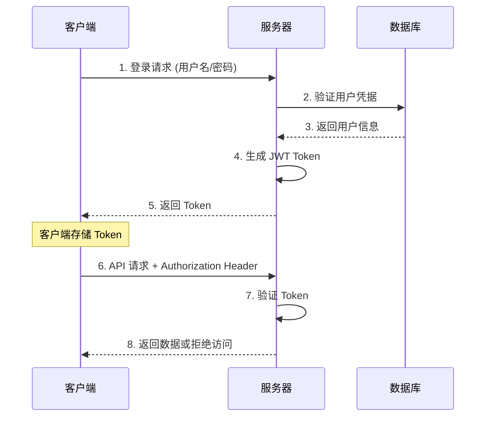

# 🔐 认证系统

Gin-Vue-Admin 采用 JWT (JSON Web Token) 作为主要的身份认证机制，提供无状态、安全、高效的用户认证解决方案。

## 🎯 认证机制概述

### JWT 认证流程



## 🔧 JWT 配置

### 配置文件设置

在 `config.yaml` 中配置 JWT 相关参数：

```yaml
jwt:
  signing-key: 'qmPlus'           # JWT 签名密钥
  expires-time: 604800s           # Token 过期时间 (7天)
  buffer-time: 86400s             # Token 缓冲时间 (1天)
  issuer: 'qmPlus'               # 签发者
```

### 配置参数说明

| 参数 | 类型 | 说明 | 默认值 |
|------|------|------|--------|
| `signing-key` | string | JWT 签名密钥，用于生成和验证 Token | qmPlus |
| `expires-time` | duration | Token 有效期，过期后需要重新登录 | 604800s (7天) |
| `buffer-time` | duration | Token 缓冲时间，在此时间内可以刷新 Token | 86400s (1天) |
| `issuer` | string | Token 签发者标识 | qmPlus |

## 🛠️ 核心组件

### JWT 中间件

位置：`server/middleware/jwt.go`

```go
// JWTAuth JWT认证中间件
func JWTAuth() gin.HandlerFunc {
    return func(c *gin.Context) {
        // 从请求头获取 Token
        token := c.Request.Header.Get("x-token")
        if token == "" {
            response.FailWithDetailed(gin.H{"reload": true}, "未登录或非法访问", c)
            c.Abort()
            return
        }
        
        // 验证 Token
        j := utils.NewJWT()
        claims, err := j.ParseToken(token)
        if err != nil {
            if err == utils.TokenExpired {
                response.FailWithDetailed(gin.H{"reload": true}, "授权已过期", c)
                c.Abort()
                return
            }
            response.FailWithDetailed(gin.H{"reload": true}, err.Error(), c)
            c.Abort()
            return
        }
        
        // 将用户信息存储到上下文
        c.Set("claims", claims)
        c.Next()
    }
}
```

### JWT 工具类

位置：`server/utils/jwt.go`

```go
type JWT struct {
    SigningKey []byte
}

type CustomClaims struct {
    BaseClaims
    BufferTime int64
    jwt.StandardClaims
}

type BaseClaims struct {
    UUID        uuid.UUID
    ID          uint
    Username    string
    NickName    string
    AuthorityId string
}

// CreateToken 创建Token
func (j *JWT) CreateToken(claims CustomClaims) (string, error) {
    token := jwt.NewWithClaims(jwt.SigningMethodHS256, claims)
    return token.SignedString(j.SigningKey)
}

// ParseToken 解析Token
func (j *JWT) ParseToken(tokenString string) (*CustomClaims, error) {
    token, err := jwt.ParseWithClaims(tokenString, &CustomClaims{}, func(token *jwt.Token) (interface{}, error) {
        return j.SigningKey, nil
    })
    
    if err != nil {
        if ve, ok := err.(*jwt.ValidationError); ok {
            if ve.Errors&jwt.ValidationErrorMalformed != 0 {
                return nil, TokenMalformed
            } else if ve.Errors&jwt.ValidationErrorExpired != 0 {
                return nil, TokenExpired
            } else if ve.Errors&jwt.ValidationErrorNotValidYet != 0 {
                return nil, TokenNotValidYet
            } else {
                return nil, TokenInvalid
            }
        }
    }
    
    if claims, ok := token.Claims.(*CustomClaims); ok && token.Valid {
        return claims, nil
    }
    return nil, TokenInvalid
}
```

## 🔑 登录实现

### 登录 API

位置：`server/api/v1/sys_user.go`

```go
// Login 用户登录
func (b *BaseApi) Login(c *gin.Context) {
    var l systemReq.Login
    err := c.ShouldBindJSON(&l)
    if err != nil {
        response.FailWithMessage(err.Error(), c)
        return
    }
    
    // 验证码校验
    if store.Verify(l.CaptchaId, l.Captcha, true) {
        // 验证用户凭据
        u := &system.SysUser{Username: l.Username, Password: l.Password}
        user, err := userService.Login(u)
        if err != nil {
            global.GVA_LOG.Error("登陆失败! 用户名不存在或者密码错误!", zap.Error(err))
            response.FailWithMessage("用户名不存在或者密码错误", c)
            return
        }
        
        // 生成 JWT Token
        b.tokenNext(c, *user)
    } else {
        response.FailWithMessage("验证码错误", c)
    }
}

// tokenNext 生成Token并返回
func (b *BaseApi) tokenNext(c *gin.Context, user system.SysUser) {
    j := &utils.JWT{SigningKey: []byte(global.GVA_CONFIG.JWT.SigningKey)}
    claims := j.CreateClaims(utils.BaseClaims{
        UUID:        user.UUID,
        ID:          user.ID,
        NickName:    user.NickName,
        Username:    user.Username,
        AuthorityId: user.AuthorityId,
    })
    
    token, err := j.CreateToken(claims)
    if err != nil {
        global.GVA_LOG.Error("获取token失败!", zap.Error(err))
        response.FailWithMessage("获取token失败", c)
        return
    }
    
    // 多点登录控制
    if !global.GVA_CONFIG.System.UseMultipoint {
        response.OkWithDetailed(systemRes.LoginResponse{
            User:      user,
            Token:     token,
            ExpiresAt: claims.StandardClaims.ExpiresAt * 1000,
        }, "登录成功", c)
        return
    }
    
    // 单点登录处理
    if jwtStr, err := jwtService.GetRedisJWT(user.Username); err == redis.Nil {
        if err := jwtService.SetRedisJWT(token, user.Username); err != nil {
            global.GVA_LOG.Error("设置登录状态失败!", zap.Error(err))
            response.FailWithMessage("设置登录状态失败", c)
            return
        }
        response.OkWithDetailed(systemRes.LoginResponse{
            User:      user,
            Token:     token,
            ExpiresAt: claims.StandardClaims.ExpiresAt * 1000,
        }, "登录成功", c)
    } else if err != nil {
        global.GVA_LOG.Error("设置登录状态失败!", zap.Error(err))
        response.FailWithMessage("设置登录状态失败", c)
    } else {
        var blackJWT system.JwtBlacklist
        blackJWT.Jwt = jwtStr
        if err := jwtService.JsonInBlacklist(blackJWT); err != nil {
            response.FailWithMessage("jwt作废失败", c)
            return
        }
        if err := jwtService.SetRedisJWT(token, user.Username); err != nil {
            response.FailWithMessage("设置登录状态失败", c)
            return
        }
        response.OkWithDetailed(systemRes.LoginResponse{
            User:      user,
            Token:     token,
            ExpiresAt: claims.StandardClaims.ExpiresAt * 1000,
        }, "登录成功", c)
    }
}
```

## 🔄 Token 刷新机制

### 自动刷新

当 Token 即将过期时（在 buffer-time 时间内），系统会自动刷新 Token：

```go
// RefreshToken 刷新Token
func (j *JWT) RefreshToken(tokenString string) (string, error) {
    jwt.TimeFunc = func() time.Time {
        return time.Unix(0, 0)
    }
    
    token, err := jwt.ParseWithClaims(tokenString, &CustomClaims{}, func(token *jwt.Token) (interface{}, error) {
        return j.SigningKey, nil
    })
    
    if err != nil {
        return "", err
    }
    
    if claims, ok := token.Claims.(*CustomClaims); ok && token.Valid {
        jwt.TimeFunc = time.Now
        claims.StandardClaims.ExpiresAt = time.Now().Add(time.Duration(global.GVA_CONFIG.JWT.ExpiresTime) * time.Second).Unix()
        return j.CreateToken(*claims)
    }
    return "", TokenInvalid
}
```

## 🚫 Token 黑名单

### 黑名单机制

为了支持用户登出和 Token 撤销，系统实现了 JWT 黑名单机制：

```go
// JwtBlacklist JWT黑名单结构体
type JwtBlacklist struct {
    global.GVA_MODEL
    Jwt string `gorm:"type:text;comment:jwt"`
}

// JsonInBlacklist 拉黑jwt
func (jwtService *JwtService) JsonInBlacklist(jwtList system.JwtBlacklist) (err error) {
    err = global.GVA_DB.Create(&jwtList).Error
    if err != nil {
        return
    }
    global.BlackCache.SetDefault(jwtList.Jwt, struct{}{})
    return
}

// IsBlacklist 判断JWT是否在黑名单内部
func (jwtService *JwtService) IsBlacklist(jwt string) bool {
    _, ok := global.BlackCache.Get(jwt)
    return ok
}
```

## 🔒 安全最佳实践

### 1. 密钥管理
- 使用强随机密钥作为签名密钥
- 定期轮换签名密钥
- 将密钥存储在安全的配置文件中

### 2. Token 生命周期
- 设置合理的过期时间（建议不超过24小时）
- 实现 Token 刷新机制
- 支持主动撤销 Token

### 3. 传输安全
- 始终使用 HTTPS 传输 Token
- 在请求头中传递 Token，避免在 URL 中暴露
- 客户端安全存储 Token

### 4. 多点登录控制
```yaml
system:
  use-multipoint: true  # 启用单点登录限制
```

## 🐛 常见问题

### Q: Token 过期如何处理？
A: 系统会返回特定的错误码，前端应该引导用户重新登录或自动刷新 Token。

### Q: 如何实现记住登录状态？
A: 可以设置较长的 Token 过期时间，或者实现 Refresh Token 机制。

### Q: 多设备登录如何控制？
A: 通过配置 `use-multipoint: true` 启用单点登录，或者实现设备管理功能。

### Q: JWT 密钥泄露怎么办？
A: 立即更换密钥，使所有现有 Token 失效，要求用户重新登录。

## 📚 相关文档

- [权限系统](./authorization.md)
- [配置管理](./config.md)
- [部署配置](../deployment/index.md)