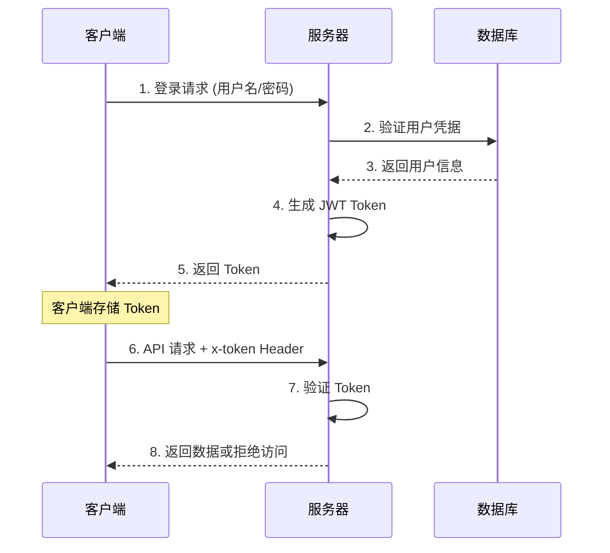

# 认证系统

Gin-Vue-Admin 采用 JWT (JSON Web Token) 作为主要的身份认证机制，提供无状态、安全、高效的用户认证解决方案。v3.0 使用 `github.com/golang-jwt/jwt/v5`（HS256 签名）。

## 认证机制概述

### JWT 认证流程


```mermaid
sequenceDiagram
    participant C as 客户端
    participant S as 服务器
    participant DB as 数据库
    
    C->>S: 1. 登录请求 (用户名/密码)
    S->>DB: 2. 验证用户凭据
    DB-->>S: 3. 返回用户信息
    S->>S: 4. 生成 JWT Token
    S-->>C: 5. 返回 Token
    
    Note over C: 客户端存储 Token
    
    C->>S: 6. API 请求 + x-token Header
    S->>S: 7. 验证 Token
    S-->>C: 8. 返回数据或拒绝访问
```

## JWT 配置

### 配置文件设置

在 `config.yaml` 中配置 JWT 相关参数：

```yaml
jwt:
  signing-key: 'qmPlus'           # JWT 签名密钥
  expires-time: 7d                # Token 过期时间 (7天)
  buffer-time: 1d                 # Token 缓冲时间 (1天)
  issuer: 'qmPlus'                # 签发者
```

### 配置参数说明

| 参数 | 类型 | 说明 | 默认值 |
|------|------|------|--------|
| `signing-key` | string | JWT 签名密钥，用于生成和验证 Token | qmPlus |
| `expires-time` | string | Token 有效期，过期后需要重新登录 | 7d (7天) |
| `buffer-time` | string | Token 缓冲时间，在此时间内可以刷新 Token | 1d (1天) |
| `issuer` | string | Token 签发者标识 | qmPlus |

::: tip 说明
`expires-time` 与 `buffer-time` 为字符串类型，除 Go duration 格式（如 `24h`）外还支持 `"7d"`、`"1d"` 这样的天数格式，由 `utils/human_duration.go` 的 `ParseDuration` 统一解析。
:::

## 核心组件

### JWT 中间件

位置：`server/middleware/jwt.go`

```go
func JWTAuth() gin.HandlerFunc {
	return func(c *gin.Context) {
		// 我们这里jwt鉴权取头部信息 x-token 登录时回返回token信息
		token := utils.GetToken(c)
		if token == "" {
			response.NoAuth("未登录或非法访问，请登录", c)
			c.Abort()
			return
		}
		if isBlacklist(token) {
			response.NoAuth("您的帐户异地登陆或令牌失效", c)
			utils.ClearToken(c)
			c.Abort()
			return
		}
		j := utils.NewJWT()
		// parseToken 解析token包含的信息
		claims, err := j.ParseToken(token)
		if err != nil {
			if errors.Is(err, utils.TokenExpired) {
				response.NoAuth("登录已过期，请重新登录", c)
				utils.ClearToken(c)
				c.Abort()
				return
			}
			response.NoAuth(err.Error(), c)
			utils.ClearToken(c)
			c.Abort()
			return
		}
		c.Set("claims", claims)
		// 缓冲期内自动续签：响应头回写 new-token / new-expires-at
		if claims.ExpiresAt.Unix()-time.Now().Unix() < claims.BufferTime {
			dr, _ := utils.ParseDuration(global.GVA_CONFIG.JWT.ExpiresTime)
			claims.ExpiresAt = jwt.NewNumericDate(time.Now().Add(dr))
			newToken, _ := j.CreateTokenByOldToken(token, *claims)
			newClaims, _ := j.ParseToken(newToken)
			c.Header("new-token", newToken)
			c.Header("new-expires-at", strconv.FormatInt(newClaims.ExpiresAt.Unix(), 10))
			utils.SetToken(c, newToken, int(dr.Seconds()))
			if global.GVA_CONFIG.System.UseMultipoint {
				// 记录新的活跃jwt
				_ = utils.SetRedisJWT(newToken, newClaims.Username)
			}
		}
		c.Next()
	}
}

// isBlacklist 黑名单检查走 GVA_CACHE
func isBlacklist(jwt string) bool {
	_, ok := global.GVA_CACHE.Get(jwt)
	return ok
}
```

要点：

- 从请求头 `x-token` 获取 Token。
- 黑名单检查直接查 `global.GVA_CACHE`（内存或 Redis 后端），不查库。
- Token 剩余有效期进入 `buffer-time` 缓冲期时**自动续签**：新 Token 通过响应头 `new-token` / `new-expires-at` 返回给前端；`CreateTokenByOldToken` 内部使用 singleflight 归并（`GVA_Concurrency_Control`），避免并发请求重复签发。
- 开启 `use-multipoint` 时，续签同时调用 `SetRedisJWT` 更新 Redis 中的活跃 Token，实现多点登录拦截。

### JWT 工具类

位置：`server/utils/jwt.go`，Claims 定义在 `server/model/system/request/jwt.go`

```go
type CustomClaims struct {
	BaseClaims
	BufferTime    int64
	MustChangePwd bool `json:"mustChangePwd"` // 强制改密标记（v3.0 新增）
	jwt.RegisteredClaims
}

type BaseClaims struct {
	UUID        uuid.UUID
	ID          uint
	Username    string
	NickName    string
	AuthorityId uint
}
```

提供的方法：

| 方法 | 说明 |
| ---- | ---- |
| `NewJWT()` | 用 `GVA_CONFIG.JWT.SigningKey` 构造 JWT 实例 |
| `CreateClaims(baseClaims)` | 按配置生成 claims（过期/缓冲时间、Issuer、受众 GVA） |
| `CreateToken(claims)` | HS256 签发 Token |
| `CreateTokenByOldToken(oldToken, claims)` | 旧 Token 换新 Token，singleflight 归并防并发重复签发 |
| `ParseToken(tokenString)` | 解析并校验 Token，返回 `TokenExpired`/`TokenMalformed` 等哨兵错误 |
| `SetRedisJWT(jwt, userName)` | 将 Token 存入 Redis（过期时间同 JWT 有效期），用于多点登录拦截 |

## 登录实现

### 登录 API

位置：`server/api/v1/system/sys_user.go`

v3.0 的登录流程在验证凭据前后接入了**安全中心**配置与**登录日志**：

```go
// Login 用户登录
func (b *BaseApi) Login(c *gin.Context) {
	var l systemReq.Login
	err := c.ShouldBindJSON(&l)
	// ... 参数校验 ...

	cfg := securityConfigService.Current(c.Request.Context())

	// 1. 账号锁定检查（安全中心配置）
	if cfg.LockEnable && systemSvc.IsAccountLocked(c.Request.Context(), l.Username) {
		response.FailWithMessage("账号已锁定，请 "+strconv.Itoa(cfg.LockDuration)+" 分钟后再试", c)
		// ... 记录登录日志 ...
		return
	}

	// 2. 验证码检查（按 IP 计数，计数存 GVA_CACHE）
	// ... 验证码错误时 Increment 计数并记录登录日志 ...

	// 3. 凭证校验
	u := &system.SysUser{Username: l.Username, Password: l.Password}
	user, err := userService.Login(c.Request.Context(), u)
	// ... 失败时 RecordLoginFail 并记录登录日志 ...

	// 4. 登录成功 清除失败计数与锁
	systemSvc.ClearLoginFail(c.Request.Context(), l.Username)

	// 5. 密码过期检查（安全中心配置）
	needChange := systemSvc.IsPasswordExpired(c.Request.Context(), user.PasswordUpdatedAt, cfg, time.Now())
	b.TokenNext(c, *user, needChange)
}
```

### 签发 Token

```go
// TokenNext 登录以后签发 jwt
func (b *BaseApi) TokenNext(c *gin.Context, user system.SysUser, mustChangePwd bool) {
	token, claims, err := utils.LoginTokenWithExpire(&user, mustChangePwd)
	// ... 记录登录成功日志 ...
	if !global.GVA_CONFIG.System.UseMultipoint {
		utils.SetToken(c, token, int(claims.RegisteredClaims.ExpiresAt.Unix()-time.Now().Unix()))
		response.OkWithDetailed(systemRes.LoginResponse{
			User:               user,
			Token:              token,
			ExpiresAt:          claims.RegisteredClaims.ExpiresAt.Unix() * 1000,
			NeedChangePassword: mustChangePwd,
		}, "登录成功", c)
		return
	}
	// 多点登录拦截：旧 Token 拉入黑名单，新 Token 写入 Redis
	if jwtStr, err := jwtService.GetRedisJWT(c.Request.Context(), user.Username); err == redis.Nil {
		// 无在线 Token，直接写入
	} else {
		// 已存在活跃 Token：JsonInBlacklist 作废旧 Token 后写入新 Token
	}
}
```

- `mustChangePwd` 会写入 claims 的 `MustChangePwd` 字段，并通过 `LoginResponse.NeedChangePassword` 返回给前端。
- `use-multipoint: true` 时，若 Redis 中已存在该用户的活跃 Token，则先把旧 Token 拉入黑名单再签发新 Token，实现单点登录。

## Token 刷新机制

### 自动刷新

无需前端主动调用刷新接口：当 Token 剩余有效期进入 `buffer-time` 缓冲期时，`JWTAuth` 中间件会在本次请求中自动续签，通过响应头返回新 Token：

- `new-token`：新签发的 Token
- `new-expires-at`：新 Token 的过期时间（秒级时间戳）

前端拦截到这两个响应头后替换本地 Token 即可。续签使用 singleflight 归并，同一旧 Token 的并发请求只会签发一次新 Token。

## Token 黑名单

### 黑名单机制

为了支持用户登出和 Token 撤销，系统实现了 JWT 黑名单机制。位置：`server/service/system/jwt_black_list.go`

```go
// JsonInBlacklist 拉黑jwt：写库的同时写入 GVA_CACHE
func (jwtService *JwtService) JsonInBlacklist(ctx context.Context, jwtList system.JwtBlacklist) (err error) {
	err = global.GVA_DB.WithContext(ctx).Create(&jwtList).Error
	if err != nil {
		return
	}
	global.GVA_CACHE.SetDefault(jwtList.Jwt, "1")
	return
}

// LoadAll 启动时把数据库全表黑名单灌入缓存
func LoadAll(ctx context.Context) {
	var data []string
	err := global.GVA_DB.WithContext(ctx).Model(&system.JwtBlacklist{}).Select("jwt").Find(&data).Error
	// ...
	for i := 0; i < len(data); i++ {
		global.GVA_CACHE.SetDefault(data[i], "1")
	} // jwt黑名单 加入 GVA_CACHE 中
}
```

- 拉黑：写 `sys_jwt_blacklist` 表的同时 `GVA_CACHE.SetDefault` 写入缓存。
- 启动时 `LoadAll` 把数据库中的全量黑名单灌入 `GVA_CACHE`，保证重启后黑名单仍然生效。
- 鉴权时只查缓存（见上方 `isBlacklist`），黑名单判断无数据库开销。

## 强制改密守卫（v3.0 新增）

位置：`server/middleware/must_change_pwd.go`

当 claims 中 `MustChangePwd=true`（密码过期或管理员重置密码后签发的 Token）时，`MustChangePwdGuard` 仅放行以下接口，其余请求一律返回 403：

- `/user/changePassword`（修改密码）
- `/user/getUserInfo`（获取用户信息）
- `/jwt/jsonInBlacklist`（登出）

```go
c.JSON(http.StatusForbidden, gin.H{
	"code": 7,
	"data": gin.H{"needChangePassword": true},
	"msg":  "密码已过期，请先修改密码",
})
```

前端收到 `needChangePassword: true` 后跳转 `/forceChangePassword` 页面引导用户改密。该中间件注册在 PrivateGroup 链上，位于 `JWTAuth` 之后、`CasbinHandler` 之前（完整链为 `JWTAuth → MustChangePwdGuard → CasbinHandler → DataScope`）。

## 安全中心与认证

v3.0 将安全配置收敛到数据库表 `sys_security_config`（后台"安全中心"页面管理，不走 config.yaml）。与认证直接相关的能力：

- **登录锁定**：连续登录失败达到阈值后锁定账号一段时间（`IsAccountLocked` / `RecordLoginFail` / `ClearLoginFail`）。
- **密码策略**：密码复杂度校验（`utils/password_complexity.go`）、密码过期强制改密（`IsPasswordExpired` + 强制改密守卫）。
- **登录日志**：每次登录成功/失败记录 `sys_login_log` 表（用户名、IP、UA、失败原因）。
- **API Token**：`sys_api_token` 支持签发长期 API Token。

安全配置的完整内容（五组配置、登录锁定、限流等）见[安全中心](./security.md)。

## 安全最佳实践

### 1. 密钥管理
- 使用强随机密钥作为签名密钥
- 定期轮换签名密钥
- 将密钥存储在安全的配置文件中

### 2. Token 生命周期
- 设置合理的过期时间（建议不超过24小时）
- 利用缓冲期自动续签机制，避免用户频繁重新登录
- 支持主动撤销 Token（登出拉黑）

### 3. 传输安全
- 始终使用 HTTPS 传输 Token
- 在请求头（x-token）中传递 Token，避免在 URL 中暴露
- 客户端安全存储 Token

### 4. 多点登录控制
```yaml
system:
  use-multipoint: true  # 启用单点登录限制
```

## 常见问题

### Q: Token 过期如何处理？
A: 系统会返回特定的错误码，前端应该引导用户重新登录；处于缓冲期内的 Token 会由中间件自动续签，前端注意处理 `new-token` 响应头。

### Q: 如何实现记住登录状态？
A: 可以设置较长的 Token 过期时间，配合缓冲期自动续签保持登录状态。

### Q: 多设备登录如何控制？
A: 通过配置 `use-multipoint: true` 启用单点登录，后登录的设备会使先登录设备的 Token 失效。

### Q: JWT 密钥泄露怎么办？
A: 立即更换密钥，使所有现有 Token 失效，要求用户重新登录。

### Q: 用户被要求强制改密是怎么回事？
A: 密码过期（安全中心配置的密码有效期）或管理员重置密码后，签发的 Token 携带 `MustChangePwd=true`，强制改密守卫会拦截除改密/用户信息/登出外的所有请求，用户修改密码后即可恢复正常。

## 相关文档

- [权限系统](./authorization.md)
- [安全中心](./security.md)
- [配置管理](./config/index.md)
- [部署配置](../deployment/index.md)
