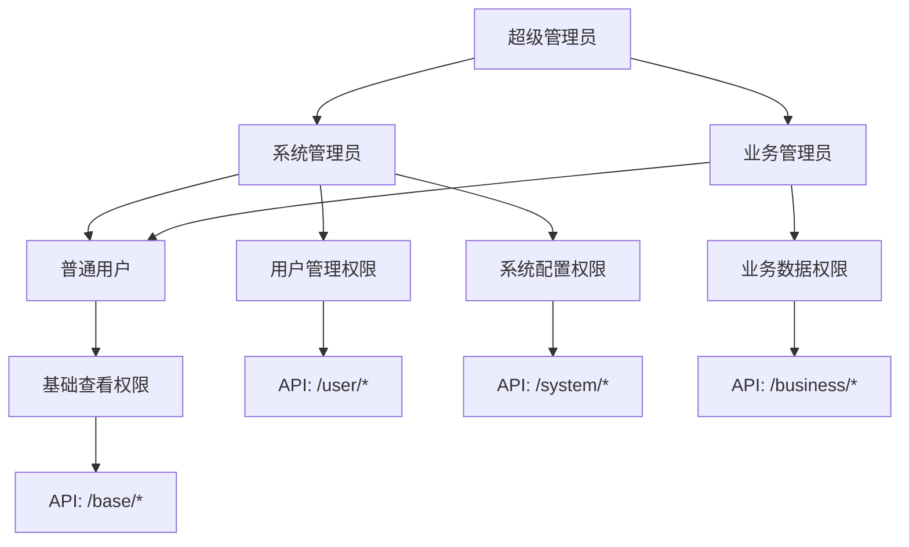

# 🛡️ 权限系统

Gin-Vue-Admin 采用 Casbin 实现基于角色的访问控制 (RBAC)，提供灵活、强大的权限管理机制，支持多层级权限控制。

## 🎯 权限模型概述

### RBAC 权限模型

```
用户 (User) ──┐
              ├─→ 角色 (Role) ──→ 权限 (Permission) ──→ 资源 (Resource)
用户组 (Group) ┘
```

### 权限层级结构



## 🔧 Casbin 配置

### 模型配置文件

位置：`server/resource/rbac_model.conf`

```ini
[request_definition]
r = sub, obj, act

[policy_definition]
p = sub, obj, act

[role_definition]
g = _, _

[policy_effect]
e = some(where (p.eft == allow))

[matchers]
m = g(r.sub, p.sub) && r.obj == p.obj && r.act == p.act
```

### 配置参数说明

| 配置项 | 说明 |
|--------|------|
| `request_definition` | 请求定义：主体(sub)、对象(obj)、动作(act) |
| `policy_definition` | 策略定义：权限规则格式 |
| `role_definition` | 角色定义：角色继承关系 |
| `policy_effect` | 策略效果：允许访问的条件 |
| `matchers` | 匹配器：权限验证逻辑 |

## 🛠️ 核心组件

### Casbin 中间件

位置：`server/middleware/casbin_rbac.go`

```go
// CasbinHandler Casbin权限验证中间件
func CasbinHandler() gin.HandlerFunc {
    return func(c *gin.Context) {
        claims, _ := c.Get("claims")
        waitUse := claims.(*utils.CustomClaims)
        
        // 获取请求信息
        obj := c.Request.URL.Path
        act := c.Request.Method
        sub := waitUse.AuthorityId
        
        // Casbin权限验证
        e := casbinService.Casbin()
        success, _ := e.Enforce(sub, obj, act)
        
        if !success {
            response.FailWithDetailed(gin.H{}, "权限不足", c)
            c.Abort()
            return
        }
        c.Next()
    }
}
```

### Casbin 服务

位置：`server/service/sys_casbin.go`

```go
type CasbinService struct{}

// UpdateCasbin 更新Casbin权限
func (casbinService *CasbinService) UpdateCasbin(authorityId string, casbinInfos []request.CasbinInfo) error {
    casbinService.ClearCasbin(0, authorityId)
    rules := [][]string{}
    for _, v := range casbinInfos {
        rules = append(rules, []string{authorityId, v.Path, v.Method})
    }
    e := casbinService.Casbin()
    success, _ := e.AddPolicies(rules)
    if !success {
        return errors.New("存在相同api,添加失败,请联系管理员")
    }
    return nil
}

// GetPolicyPathByAuthorityId 获取权限列表
func (casbinService *CasbinService) GetPolicyPathByAuthorityId(authorityId string) (pathMaps []request.CasbinInfo) {
    e := casbinService.Casbin()
    list := e.GetFilteredPolicy(0, authorityId)
    for _, v := range list {
        pathMaps = append(pathMaps, request.CasbinInfo{
            Path:   v[1],
            Method: v[2],
        })
    }
    return pathMaps
}

// ClearCasbin 清除权限
func (casbinService *CasbinService) ClearCasbin(v int, p ...string) bool {
    e := casbinService.Casbin()
    success, _ := e.RemoveFilteredPolicy(v, p...)
    return success
}

// Casbin 获取Casbin实例
func (casbinService *CasbinService) Casbin() *casbin.Enforcer {
    return global.GVA_CASBIN
}
```

## 🏗️ 权限数据结构

### 角色表 (sys_authorities)

```go
type SysAuthority struct {
    CreatedAt     time.Time
    UpdatedAt     time.Time
    DeletedAt     *time.Time `sql:"index"`
    AuthorityId   string     `json:"authorityId" gorm:"not null;unique;primary_key;comment:角色ID;size:90"`
    AuthorityName string     `json:"authorityName" gorm:"comment:角色名"`
    ParentId      string     `json:"parentId" gorm:"comment:父角色ID"`
    DataAuthorityId []string `json:"dataAuthorityId" gorm:"-"`
    Children      []SysAuthority `json:"children" gorm:"-"`
    SysBaseMenus  []SysBaseMenu  `json:"menus" gorm:"many2many:sys_authority_menus;"`
    Users         []SysUser      `json:"-" gorm:"many2many:sys_user_authority;"`
    DefaultRouter string `json:"defaultRouter" gorm:"comment:默认菜单;default:dashboard"`
}
```

### 权限规则表 (casbin_rule)

```go
type CasbinRule struct {
    ID    uint   `gorm:"primaryKey;autoIncrement"`
    Ptype string `gorm:"size:512;uniqueIndex:unique_index"`
    V0    string `gorm:"size:512;uniqueIndex:unique_index"`
    V1    string `gorm:"size:512;uniqueIndex:unique_index"`
    V2    string `gorm:"size:512;uniqueIndex:unique_index"`
    V3    string `gorm:"size:512;uniqueIndex:unique_index"`
    V4    string `gorm:"size:512;uniqueIndex:unique_index"`
    V5    string `gorm:"size:512;uniqueIndex:unique_index"`
}
```

### API 权限表 (sys_apis)

```go
type SysApi struct {
    global.GVA_MODEL
    Path        string `json:"path" gorm:"comment:api路径"`
    Description string `json:"description" gorm:"comment:api中文描述"`
    ApiGroup    string `json:"apiGroup" gorm:"comment:api组"`
    Method      string `json:"method" gorm:"default:POST;comment:方法"`
}
```

## 🎛️ 权限管理功能

### 1. 角色管理

#### 创建角色

```go
// CreateAuthority 创建角色
func (authorityService *AuthorityService) CreateAuthority(auth system.SysAuthority) (authority system.SysAuthority, err error) {
    var authorityBox system.SysAuthority
    if !errors.Is(global.GVA_DB.Where("authority_id = ?", auth.AuthorityId).First(&authorityBox).Error, gorm.ErrRecordNotFound) {
        return auth, errors.New("存在相同角色id")
    }
    err = global.GVA_DB.Create(&auth).Error
    return auth, err
}
```

#### 角色继承

```go
// 设置角色继承关系
e := casbinService.Casbin()
e.AddRoleForUser("user1", "role1")  // 用户继承角色
e.AddRoleForUser("role1", "role2")  // 角色继承角色
```

### 2. API 权限管理

#### 分配 API 权限

```go
// UpdateCasbinApi 更新API权限
func (casbinService *CasbinService) UpdateCasbinApi(oldPath string, newPath string, oldMethod string, newMethod string) error {
    err := global.GVA_DB.Model(&gormadapter.CasbinRule{}).Where("v1 = ? AND v2 = ?", oldPath, oldMethod).Updates(map[string]interface{}{
        "v1": newPath,
        "v2": newMethod,
    }).Error
    e := casbinService.Casbin()
    err = e.LoadPolicy()
    return err
}
```

#### API 权限验证

```go
// 权限验证示例
func checkPermission(userId, path, method string) bool {
    e := casbinService.Casbin()
    
    // 获取用户角色
    roles := e.GetRolesForUser(userId)
    
    // 检查权限
    for _, role := range roles {
        if ok, _ := e.Enforce(role, path, method); ok {
            return true
        }
    }
    return false
}
```

### 3. 菜单权限管理

#### 菜单权限表 (sys_base_menus)

```go
type SysBaseMenu struct {
    global.GVA_MODEL
    MenuLevel     uint                                     `json:"-"`
    ParentId      string                                   `json:"parentId" gorm:"comment:父菜单ID"`
    Path          string                                   `json:"path" gorm:"comment:路由path"`
    Name          string                                   `json:"name" gorm:"comment:路由name"`
    Hidden        bool                                     `json:"hidden" gorm:"comment:是否在列表隐藏"`
    Component     string                                   `json:"component" gorm:"comment:对应前端文件路径"`
    Sort          int                                      `json:"sort" gorm:"comment:排序标记"`
    Meta          `json:"meta" gorm:"embedded;comment:附加属性"`
    SysAuthoritys []SysAuthority                          `json:"authoritys" gorm:"many2many:sys_authority_menus;"`
    Children      []SysBaseMenu                           `json:"children" gorm:"-"`
    Parameters    []SysBaseMenuParameter                  `json:"parameters"`
    MenuBtn       []SysBaseMenuBtn                        `json:"menuBtn"`
}
```

#### 动态菜单生成

```go
// GetMenuTree 获取动态菜单树
func (menuService *MenuService) GetMenuTree(authorityId string) (menus []system.SysMenu, err error) {
    menuTree, err := menuService.getMenuTreeMap(authorityId)
    menus = menuTree["0"]
    for i := 0; i < len(menus); i++ {
        err = menuService.getChildrenList(&menus[i], menuTree)
    }
    return menus, err
}
```

### 4. 按钮权限管理

#### 按钮权限表 (sys_base_menu_btns)

```go
type SysBaseMenuBtn struct {
    global.GVA_MODEL
    Name          string `json:"name" gorm:"comment:按钮关键key"`
    Desc          string `json:"desc" gorm:"comment:按钮备注"`
    SysBaseMenuID uint   `json:"sysBaseMenuID" gorm:"comment:菜单ID"`
}
```

#### 前端按钮权限控制

```vue
<template>
  <!-- 使用 v-auth 指令控制按钮显示 -->
  <el-button v-auth="'user:create'" @click="createUser">
    创建用户
  </el-button>
  
  <el-button v-auth="'user:delete'" @click="deleteUser">
    删除用户
  </el-button>
</template>

<script>
// 权限指令实现
app.directive('auth', {
  mounted(el, binding) {
    const { value } = binding
    const userStore = useUserStore()
    
    if (!userStore.hasPermission(value)) {
      el.style.display = 'none'
    }
  }
})
</script>
```

## 🔄 权限同步机制

### 权限缓存更新

```go
// 权限变更时同步缓存
func (casbinService *CasbinService) FreshCasbin() (err error) {
    e := casbinService.Casbin()
    err = e.LoadPolicy()
    return err
}

// 清除用户权限缓存
func (casbinService *CasbinService) ClearUserCache(userId string) {
    // 清除Redis中的用户权限缓存
    global.GVA_REDIS.Del(context.Background(), "user:permissions:"+userId)
}
```

### 实时权限验证

```go
// 实时权限检查
func (casbinService *CasbinService) CheckPermission(userId, resource, action string) bool {
    // 1. 检查缓存
    cacheKey := fmt.Sprintf("permission:%s:%s:%s", userId, resource, action)
    if result, err := global.GVA_REDIS.Get(context.Background(), cacheKey).Result(); err == nil {
        return result == "true"
    }
    
    // 2. 实时验证
    e := casbinService.Casbin()
    hasPermission, _ := e.Enforce(userId, resource, action)
    
    // 3. 缓存结果
    global.GVA_REDIS.Set(context.Background(), cacheKey, hasPermission, time.Minute*5)
    
    return hasPermission
}
```

## 🎨 前端权限集成

### 路由权限控制

```javascript
// router/permission.js
import { useUserStore } from '@/pinia/modules/user'

router.beforeEach(async (to, from, next) => {
  const userStore = useUserStore()
  
  // 检查登录状态
  if (!userStore.token) {
    if (to.path !== '/login') {
      return next('/login')
    }
    return next()
  }
  
  // 检查路由权限
  if (to.meta.requiresAuth) {
    const hasPermission = await userStore.checkRoutePermission(to.path)
    if (!hasPermission) {
      return next('/403')
    }
  }
  
  next()
})
```

### API 权限拦截

```javascript
// utils/request.js
import axios from 'axios'
import { useUserStore } from '@/pinia/modules/user'

// 请求拦截器
axios.interceptors.request.use(
  config => {
    const userStore = useUserStore()
    
    // 添加 Token
    if (userStore.token) {
      config.headers['x-token'] = userStore.token
    }
    
    return config
  },
  error => Promise.reject(error)
)

// 响应拦截器
axios.interceptors.response.use(
  response => response,
  error => {
    if (error.response?.status === 403) {
      // 权限不足处理
      ElMessage.error('权限不足')
      return Promise.reject(error)
    }
    
    if (error.response?.status === 401) {
      // Token 过期处理
      const userStore = useUserStore()
      userStore.logout()
      router.push('/login')
    }
    
    return Promise.reject(error)
  }
)
```

## 🔒 安全最佳实践

### 1. 最小权限原则
- 用户只获得完成工作所需的最小权限
- 定期审查和清理不必要的权限
- 实现权限的时效性控制

### 2. 权限分离
- 管理权限与业务权限分离
- 读权限与写权限分离
- 敏感操作需要额外验证

### 3. 审计日志
```go
// 权限操作日志
type PermissionLog struct {
    UserID    string    `json:"user_id"`
    Action    string    `json:"action"`
    Resource  string    `json:"resource"`
    Result    bool      `json:"result"`
    IP        string    `json:"ip"`
    UserAgent string    `json:"user_agent"`
    Timestamp time.Time `json:"timestamp"`
}

// 记录权限操作
func LogPermissionCheck(userID, action, resource string, result bool, c *gin.Context) {
    log := PermissionLog{
        UserID:    userID,
        Action:    action,
        Resource:  resource,
        Result:    result,
        IP:        c.ClientIP(),
        UserAgent: c.GetHeader("User-Agent"),
        Timestamp: time.Now(),
    }
    
    // 记录到数据库或日志文件
    global.GVA_LOG.Info("Permission Check", zap.Any("log", log))
}
```

## 🐛 常见问题

### Q: 权限修改后不生效？
A: 需要调用 `e.LoadPolicy()` 重新加载权限策略，或重启应用。

### Q: 如何实现数据权限控制？
A: 可以在 Casbin 规则中添加数据范围字段，或使用自定义的数据过滤器。

### Q: 权限验证性能如何优化？
A: 使用 Redis 缓存权限结果，设置合理的缓存过期时间。

### Q: 如何实现临时权限？
A: 可以在权限规则中添加时间字段，或使用定时任务清理过期权限。

## 📚 相关文档

- [认证系统](./authentication.md)
- [用户管理](../manual/user-management.md)
- [API 设计](./api-design.md)
- [Casbin 官方文档](https://casbin.org/)