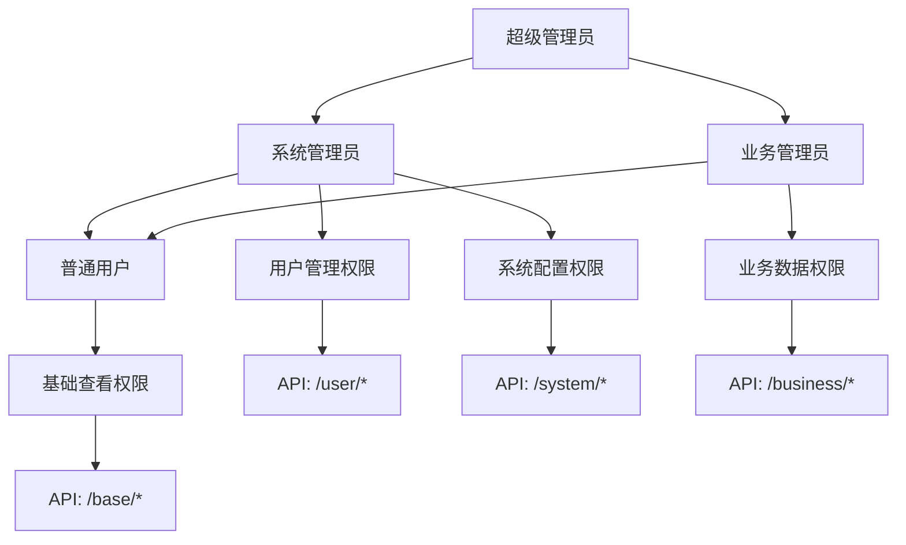

# 权限系统

Gin-Vue-Admin 采用 Casbin 实现基于角色的访问控制 (RBAC)，提供灵活、强大的权限管理机制，支持多层级权限控制。v3.0 使用 `github.com/casbin/casbin/v3`，并新增了基于组织架构（部门/岗位）的行级**数据权限**。

## 权限模型概述

### RBAC 权限模型

```
用户 (User) ──┐
              ├─→ 角色 (Role) ──→ 权限 (Permission) ──→ 资源 (Resource)
用户组 (Group) ┘
```

### 权限层级结构


```mermaid
graph TD
    A[超级管理员] --> B[系统管理员]
    A --> C[业务管理员]
    B --> D[普通用户]
    C --> D
    
    B --> E[用户管理权限]
    B --> F[系统配置权限]
    C --> G[业务数据权限]
    D --> H[基础查看权限]
    
    E --> I[API: /user/*]
    F --> J[API: /system/*]
    G --> K[API: /business/*]
    H --> L[API: /base/*]
```

## Casbin 配置

### 模型定义

v3.0 起 Casbin 模型不再使用 `resource/rbac_model.conf` 配置文件，而是内嵌在 `server/utils/casbin_util.go` 中：

```ini
[request_definition]
r = sub, obj, act

[policy_definition]
p = sub, obj, act

[role_definition]
g = _, _

[policy_effect]
e = some(where (p.eft == allow))

[matchers]
m = r.sub == p.sub && keyMatch2(r.obj,p.obj) && r.act == p.act
```

### 配置参数说明

| 配置项 | 说明 |
|--------|------|
| `request_definition` | 请求定义：主体(sub)、对象(obj)、动作(act) |
| `policy_definition` | 策略定义：权限规则格式 |
| `role_definition` | 角色定义：角色继承关系 |
| `policy_effect` | 策略效果：允许访问的条件 |
| `matchers` | 匹配器：权限验证逻辑，`keyMatch2` 支持 RESTful 路径通配（如 `/user/:id`） |

### Enforcer 实例

`utils.GetCasbin()` 以 `sync.Once` 单例返回 `*casbin.SyncedCachedEnforcer`（并发安全、带决策缓存，缓存过期时间 3600 秒），策略通过 gorm-adapter 持久化到 `casbin_rule` 表。

## 核心组件

### Casbin 中间件

位置：`server/middleware/casbin_rbac.go`

```go
// CasbinHandler 拦截器
func CasbinHandler() gin.HandlerFunc {
	return func(c *gin.Context) {
		waitUse, _ := utils.GetClaims(c)
		//获取请求的PATH
		path := c.Request.URL.Path
		obj := strings.TrimPrefix(path, global.GVA_CONFIG.System.RouterPrefix)
		// 获取请求方法
		act := c.Request.Method
		// 获取用户的角色
		sub := strconv.Itoa(int(waitUse.AuthorityId))
		e := utils.GetCasbin() // 判断策略中是否存在
		success, _ := e.Enforce(sub, obj, act)
		if !success {
			response.FailWithDetailed(gin.H{}, "权限不足", c)
			c.Abort()
			return
		}
		c.Next()
	}
}
```

要点：从 claims 取 `AuthorityId` 作 sub，请求路径（去掉 `router-prefix` 全局前缀）作 obj、请求方法作 act。

### Casbin 服务

位置：`server/service/system/sys_casbin.go`

```go
type CasbinService struct{}

// UpdateCasbin 更新Casbin权限（先校验角色上下级，严格模式下校验 API 是否在权限列表内）
func (casbinService *CasbinService) UpdateCasbin(ctx context.Context, adminAuthorityID, AuthorityID uint, casbinInfos []request.CasbinInfo) error {
	err := AuthorityServiceApp.CheckAuthorityIDAuth(ctx, adminAuthorityID, AuthorityID)
	if err != nil {
		return err
	}
	// ... UseStrictAuth 严格模式校验 ...
	authorityId := strconv.Itoa(int(AuthorityID))
	casbinService.ClearCasbin(0, authorityId)
	// ... 权限去重后 AddPolicies ...
	e := utils.GetCasbin()
	success, err := e.AddPolicies(rules)
	// ...
}
```

其他常用方法：

| 方法 | 说明 |
| ---- | ---- |
| `UpdateCasbinApi(ctx, oldPath, newPath, oldMethod, newMethod)` | API 路径/方法更新时同步 casbin_rule 并重新加载策略 |
| `GetPolicyPathByAuthorityId(AuthorityID)` | 获取角色的权限列表 |
| `ClearCasbin(v, p...)` | 清除权限 |
| `FreshCasbin()` | 重新加载策略（`LoadPolicy`） |
| `GetAuthoritiesByApi(ctx, path, method)` | 反查拥有某 API 的角色 |
| `SetApiAuthorities(ctx, path, method, authorityIds)` | 以 API 为视角设置拥有它的角色集 |

## 权限数据结构

### 角色表 (sys_authorities)

```go
type SysAuthority struct {
	CreatedAt     time.Time
	UpdatedAt     time.Time
	DeletedAt     *time.Time     `sql:"index"`
	AuthorityId   uint           `json:"authorityId" gorm:"not null;unique;primary_key;comment:角色ID;size:90"` // 角色ID
	AuthorityName string         `json:"authorityName" gorm:"comment:角色名"`                                    // 角色名
	ParentId      *uint          `json:"parentId" gorm:"comment:父角色ID"`                                       // 父角色ID
	Children      []SysAuthority `json:"children" gorm:"-"`
	SysBaseMenus  []SysBaseMenu  `json:"menus" gorm:"many2many:sys_authority_menus;"`
	Users         []SysUser      `json:"-" gorm:"many2many:sys_user_authority;"`
	DataScope     int            `json:"dataScope" gorm:"default:1;comment:数据范围 1全部 2本部门及子级 3本部门 4仅本人"` // 数据范围(数据权限)
	DefaultRouter string         `json:"defaultRouter" gorm:"comment:默认菜单;default:dashboard"`                  // 默认菜单(默认dashboard)
}
```

::: warning 注意
v3.0 起 `AuthorityId` 为 `uint` 类型（旧版本为 string）；`DataScope` 为 v3.0 新增的数据范围字段，详见下文[数据权限](#数据权限-v3-0-新增)。
:::

### 权限规则表 (casbin_rule)

```go
type CasbinRule struct {
	ID    uint   `gorm:"primaryKey;autoIncrement"`
	Ptype string `gorm:"size:512;uniqueIndex:unique_index"`
	V0    string `gorm:"size:512;uniqueIndex:unique_index"`
	V1    string `gorm:"size:512;uniqueIndex:unique_index"`
	V2    string `gorm:"size:512;uniqueIndex:unique_index"`
	V3    string `gorm:"size:512;uniqueIndex:unique_index"`
	V4    string `gorm:"size:512;uniqueIndex:unique_index"`
	V5    string `gorm:"size:512;uniqueIndex:unique_index"`
}
```

### API 权限表 (sys_apis)

```go
type SysApi struct {
	global.GVA_MODEL
	Path        string `json:"path" gorm:"comment:api路径"`
	Description string `json:"description" gorm:"comment:api中文描述"`
	ApiGroup    string `json:"apiGroup" gorm:"comment:api组"`
	Method      string `json:"method" gorm:"default:POST;comment:方法"`
}
```

## 数据权限（v3.0 新增）

v3.0 在 RBAC（接口级权限）之上新增**行级数据权限**：同一接口，不同角色的用户看到的数据行范围不同，由角色上的 `DataScope` 字段与组织架构（部门/岗位）共同决定。

引擎实现于 `server/utils/datascope/datascope.go`，核心设计是**"漏写 = 默认安全"**：只有带 `dept_id` / `created_by` 归属列的业务表才会被约束，没有归属列的表完全不受影响，`sys_` 前缀的系统表自动跳过。

### 快速上手：让你的业务表拥有数据权限

只需要三步，**不需要写任何过滤代码**。

#### 第一步：给模型加归属列

数据权限按**数据库列名**识别归属列，Go 结构体字段名可以自定义，但列名必须是以下四个之一：

| 列名 | 类型 | 作用 | 何时自动填值 |
| ---- | ---- | ---- | ------------ |
| `dept_id` | uint | 归属部门列。档位 2/3/5（部门类）按它过滤数据行 | 创建时自动盖当前用户的**主部门**（主部门为 0 则不盖） |
| `created_by` | uint | 创建人列。档位 4（仅本人）按它过滤 | 创建时自动盖当前用户 ID |
| `updated_by` | uint | 更新人列（纯审计，不参与过滤） | 更新时自动盖当前用户 ID |
| `deleted_by` | uint | 删除人列（纯审计，不参与过滤） | 软删除时并入同一条 UPDATE（表需含软删除字段） |

按需求选加：

- 只想"按部门隔离数据"：加 `dept_id` 一列即可；
- 想要"仅本人"：加 `created_by`（建议与 `dept_id` 一起加，没有 `created_by` 时"仅本人"档会降级为"本部门"）；
- `updated_by` / `deleted_by` 为可选的审计盖章列，加不加不影响过滤。

模型写法（项目内置的客户示例 `server/model/example/exa_customer.go` 就是数据权限的示范）：

```go
type ExaCustomer struct {
	global.GVA_MODEL
	CustomerName string `json:"customerName" form:"customerName" gorm:"comment:客户名"`
	// 数据权限归属列：列名必须是 dept_id / created_by
	DeptId    uint `json:"deptId" form:"deptId" gorm:"column:dept_id;comment:归属部门ID(数据权限)"`
	CreatedBy uint `json:"createdBy" form:"createdBy" gorm:"column:created_by;comment:创建人(数据权限)"`
}
```

`global.GVA_MODEL` 内含 `ID/CreatedAt/UpdatedAt/DeletedAt`，其中的 `DeletedAt` 是软删除字段，`deleted_by` 盖章依赖它。

#### 第二步：Service 层查询带 `WithContext(ctx)`

数据权限身份由中间件注入 `c.Request.Context()`，GORM 回调从 `db.Statement.Context` 读取，因此 Service 层必须用 `WithContext` 透传上下文：

```go
func (s *ExaCustomerService) GetExaCustomerList(ctx context.Context, info request.ExaCustomerListSearch) (list []example.ExaCustomer, total int64, err error) {
	db := global.GVA_DB.WithContext(ctx).Model(&example.ExaCustomer{})
	// ... 拼接业务查询条件，数据范围条件由引擎自动追加
	err = db.Count(&total).Error
	err = db.Limit(limit).Offset(offset).Find(&list).Error
	return
}
```

**AutoCode 生成的代码已经全部带 `WithContext(ctx)`**，无需手动处理。手写业务代码时注意两点：

- 更新操作建议 `Omit("dept_id", "created_by")`，防止前端提交篡改归属（客户示例的做法：`global.GVA_DB.WithContext(ctx).Omit("dept_id", "created_by").Save(e)`）；
- 不带 `WithContext` 的查询引擎拿不到身份：当前版本**放行**但记录 `no_identity` 审计日志并输出警告，属于"待补 ctx"的信号。

#### 第三步：后台配置角色与部门

1. **部门管理**（超级管理员 → 部门管理）：维护部门树；
2. **用户管理**：给用户设置主部门（`sys_users.dept_id`）和/或所属多部门；
3. **角色管理 → 数据范围**：为角色选择档位；选择"自定义部门集"时还需勾选具体部门集合。

完成以上三步后，该角色用户对受控表的查询、更新、删除会被自动行级过滤。

### 数据范围五档

常量定义在 `server/utils/datascope/datascope.go`。查询、更新、删除使用同一套过滤规则：

| 档位 | 常量 | 说明 | 自动追加的过滤条件 |
| ---- | ---- | ---- | ------------------ |
| 1 | `ScopeAll` | 全部数据 | 不加任何条件 |
| 2 | `ScopeDeptAndChild` | 本部门及以下（含子部门） | `dept_id IN (所有归属部门的子树并集)` |
| 3 | `ScopeDept` | 本部门（不含子级） | `dept_id IN (主部门 + 所属多部门)` |
| 4 | `ScopeSelf` | 仅本人 | `created_by = 当前用户ID`；表没有 `created_by` 列时降级为"本部门" |
| 5 | `ScopeCustom` | 自定义部门集 | `dept_id IN (角色配置的部门集)`，直接集合，不展开子树 |

::: warning 安全默认
对应集合为空时（如用户没有部门、角色未配置部门集），过滤条件按 `IN (0)` 处理——**一行数据都看不到**，而不是放行全部。同理，`dept_id` 为 0 或 NULL 的历史数据不在任何部门集合内，只有"全部"档的角色能看到，需要回填归属部门后才能被部门档用户看到。
:::

### 新增模型

| 模型 | 说明 |
| ---- | ---- |
| `SysDepartment` | 部门（组织架构树），维护 `Ancestors` 祖级链（逗号分隔，如 `0,1,5`），便于快速取子树 |
| `SysPosition` | 岗位 |
| `SysUserDepartment` | 用户-部门多对多关联 |
| `SysUserPosition` | 用户-岗位多对多关联 |
| `SysAuthorityDepartment` | 角色-部门关联，即"自定义部门集"档的部门集合 |
| `SysDataAccessLog` | 数据访问审计日志（`sys_data_access_logs`），事件类型如 `no_identity`（无身份访问）、`blocked_write`（疑似越权写） |

### 运行链路

```
请求 → JWTAuth → MustChangePwdGuard → CasbinHandler → DataScope 中间件
                                                        │
                          BuildIdentity 构建身份并注入 request.Context()
                                                        │
              Service 层 WithContext(ctx) 透传 → GORM 回调做行级过滤/盖章/审计
```

1. **身份构建**（`server/middleware/data_scope.go`）：在 JWT 之后调用 `DataScopeService.BuildIdentity(ctx, userID, authorityID)`，聚合以下信息构建本次请求的数据权限身份，注入 `request.Context()`：
   - 角色数据范围档位（查不到或未配置时默认"全部"）；
   - 用户主部门（`sys_users.dept_id`）；
   - 用户全部归属部门（`SysUserDepartment` 多部门）；
   - 可见部门 = 所有归属部门子树的并集（内存 BFS 计算，供"本部门及以下"档使用）；
   - 自定义部门集（档位为 5 时查 `SysAuthorityDepartment`，直接集合不展开子树）。
   
   构建过程中的内部查询统一带 `data_scope:skip` 标记旁路过滤，避免回调递归。

2. **行级过滤与盖章**（`server/utils/datascope` 的 GORM 回调，由 `server/initialize/data_scope.go` 注册，覆盖主库 `GVA_DB` 与多库 `GVA_DBList`）：
   - 查询/更新/删除前按身份自动追加数据范围 WHERE；
   - 创建时自动盖 `created_by` / `dept_id`，更新时自动盖 `updated_by`，软删除时把 `deleted_by` 并入同一条 UPDATE；
   - 审计事件异步写入 `sys_data_access_logs`；
   - `sys_` 前缀的系统表自动跳过，防止递归。

### 护栏与旁路

- **显式旁路**：单次查询跳过数据权限，使用 `db.Set("data_scope:skip", true)`；
- **系统上下文**：定时任务、初始化、CLI 等无请求身份但确属系统行为的场景，用 `datascope.WithSystem(ctx)` 标记后放行（否则按"无身份"放行并记 `no_identity` 审计）；
- **缺失条件的写操作**：`update` / `delete` 没有自带任何 WHERE 条件时，引擎**不注入**范围条件，保留 GORM 的 `ErrMissingWhereClause` 护栏；使用 `Session(&gorm.Session{AllowGlobalUpdate: true})` 显式声明全量写时，引擎会注入范围条件，把全量写收敛到数据范围内；
- **疑似越权审计**：写操作被数据范围过滤后影响 0 行，记录 `blocked_write` 审计事件（启发式信号：目标行本就不存在也会命中，用于排查而非定罪）。审计记录见 **超级管理员 → 数据访问日志**。

### 管理接口与页面

- 后端接口：`/department/*`（部门管理）、`/position/*`（岗位管理）、`/dataAccessLog/*`（数据访问日志）。
- 前端页面：**超级管理员** 下的 **部门管理**、**岗位管理**、**数据访问日志**；数据范围在 **角色管理** 中按角色设置（setDataScope）。旧版本的"数据权限"独立页面已删除。

## 权限管理功能

### 1. 角色管理

#### 角色继承

```go
// 设置角色继承关系
e := utils.GetCasbin()
e.AddRoleForUser("user1", "role1")  // 用户继承角色
e.AddRoleForUser("role1", "role2")  // 角色继承角色
```

### 2. API 权限管理

#### 分配 API 权限

```go
// UpdateCasbinApi 更新API权限
func (casbinService *CasbinService) UpdateCasbinApi(ctx context.Context, oldPath string, newPath string, oldMethod string, newMethod string) error {
	err := global.GVA_DB.WithContext(ctx).Model(&gormadapter.CasbinRule{}).Where("v1 = ? AND v2 = ?", oldPath, oldMethod).Updates(map[string]interface{}{
		"v1": newPath,
		"v2": newMethod,
	}).Error
	e := utils.GetCasbin()
	err = e.LoadPolicy()
	return err
}
```

### 3. 菜单权限管理

#### 菜单权限表 (sys_base_menus)

```go
type SysBaseMenu struct {
	global.GVA_MODEL
	MenuLevel     uint                                     `json:"-"`
	ParentId      string                                   `json:"parentId" gorm:"comment:父菜单ID"`
	Path          string                                   `json:"path" gorm:"comment:路由path"`
	Name          string                                   `json:"name" gorm:"comment:路由name"`
	Hidden        bool                                     `json:"hidden" gorm:"comment:是否在列表隐藏"`
	Component     string                                   `json:"component" gorm:"comment:对应前端文件路径"`
	Sort          int                                      `json:"sort" gorm:"comment:排序标记"`
	Meta          `json:"meta" gorm:"embedded;comment:附加属性"`
	SysAuthoritys []SysAuthority                          `json:"authoritys" gorm:"many2many:sys_authority_menus;"`
	Children      []SysBaseMenu                           `json:"children" gorm:"-"`
	Parameters    []SysBaseMenuParameter                  `json:"parameters"`
	MenuBtn       []SysBaseMenuBtn                        `json:"menuBtn"`
}
```

#### 动态菜单生成

```go
// GetMenuTree 获取动态菜单树
func (menuService *MenuService) GetMenuTree(authorityId string) (menus []system.SysMenu, err error) {
	menuTree, err := menuService.getMenuTreeMap(authorityId)
	menus = menuTree["0"]
	for i := 0; i < len(menus); i++ {
		err = menuService.getChildrenList(&menus[i], menuTree)
	}
	return menus, err
}
```

### 4. 按钮权限管理

#### 按钮权限表 (sys_base_menu_btns)

```go
type SysBaseMenuBtn struct {
	global.GVA_MODEL
	Name          string `json:"name" gorm:"comment:按钮关键key"`
	Desc          string `json:"desc" gorm:"comment:按钮备注"`
	SysBaseMenuID uint   `json:"sysBaseMenuID" gorm:"comment:菜单ID"`
}
```

#### 前端按钮权限控制

```vue
<template>
  <!-- 使用 v-auth 指令控制按钮显示 -->
  <el-button v-auth="'user:create'" @click="createUser">
    创建用户
  </el-button>
  
  <el-button v-auth="'user:delete'" @click="deleteUser">
    删除用户
  </el-button>
</template>

<script>
// 权限指令实现
app.directive('auth', {
  mounted(el, binding) {
    const { value } = binding
    const userStore = useUserStore()
    
    if (!userStore.hasPermission(value)) {
      el.style.display = 'none'
    }
  }
})
</script>
```

## 权限同步机制

### 权限变更后刷新

```go
// 权限变更时重新加载策略
func (casbinService *CasbinService) FreshCasbin() (err error) {
	e := utils.GetCasbin()
	err = e.LoadPolicy()
	return err
}
```

`utils.GetCasbin()` 返回的 `SyncedCachedEnforcer` 自带决策缓存（过期时间 3600 秒），`Enforce` 高频调用不会每次都查库；权限策略变更后调用 `FreshCasbin()` 重新加载即可。

## 前端权限集成

### 路由权限控制

```javascript
// router/permission.js
import { useUserStore } from '@/pinia/modules/user'

router.beforeEach(async (to, from, next) => {
  const userStore = useUserStore()
  
  // 检查登录状态
  if (!userStore.token) {
    if (to.path !== '/login') {
      return next('/login')
    }
    return next()
  }
  
  // 检查路由权限
  if (to.meta.requiresAuth) {
    const hasPermission = await userStore.checkRoutePermission(to.path)
    if (!hasPermission) {
      return next('/403')
    }
  }
  
  next()
})
```

### API 权限拦截

```javascript
// utils/request.js
import axios from 'axios'
import { useUserStore } from '@/pinia/modules/user'

// 请求拦截器
axios.interceptors.request.use(
  config => {
    const userStore = useUserStore()
    
    // 添加 Token
    if (userStore.token) {
      config.headers['x-token'] = userStore.token
    }
    
    return config
  },
  error => Promise.reject(error)
)

// 响应拦截器
axios.interceptors.response.use(
  response => response,
  error => {
    if (error.response?.status === 403) {
      // 权限不足处理
      ElMessage.error('权限不足')
      return Promise.reject(error)
    }
    
    if (error.response?.status === 401) {
      // Token 过期处理
      const userStore = useUserStore()
      userStore.logout()
      router.push('/login')
    }
    
    return Promise.reject(error)
  }
)
```

## 安全最佳实践

### 1. 最小权限原则
- 用户只获得完成工作所需的最小权限
- 定期审查和清理不必要的权限
- 实现权限的时效性控制

### 2. 权限分离
- 管理权限与业务权限分离
- 读权限与写权限分离
- 敏感操作需要额外验证

### 3. 审计日志
- 接口级：操作记录（operation 中间件）记录每个请求的入参与响应。
- 数据级：数据权限的审计事件（无身份访问、疑似越权写等）异步写入 `sys_data_access_logs`，可在后台"数据访问日志"页面查看。

## 常见问题

### Q: 权限修改后不生效？
A: 需要调用 `e.LoadPolicy()` 重新加载权限策略，或重启应用。

### Q: 如何实现数据权限控制？
A: v3.0 已内置，给业务模型加 `dept_id` / `created_by` 归属列、Service 层查询带 `WithContext(ctx)`、再在角色管理中设置数据范围档位即可，无需写过滤代码。完整步骤见上文[快速上手](#快速上手-让你的业务表拥有数据权限)。

### Q: 权限验证性能如何优化？
A: `utils.GetCasbin()` 返回带缓存的 `SyncedCachedEnforcer`，决策结果有缓存（过期时间 3600 秒），一般无需额外缓存。

### Q: 数据权限为什么对某些表不生效？
A: 常见原因有四个：表是 `sys_` 前缀的系统表（自动跳过）；模型没有 `dept_id` / `created_by` 归属列（引擎不碰无归属列的表）；Service 层查询没带 `WithContext(ctx)`（此时会放行并记录 `no_identity` 审计，可在 **数据访问日志** 页面核实）；或者该角色的数据范围档位本来就是"全部"。

### Q: 为什么有些数据谁都看不到？
A: 这些行的 `dept_id` 为 0 或 NULL，不在任何用户的部门集合内，只有"全部"档的角色能看到。历史数据需要先回填归属部门；新建数据会在创建时自动盖当前用户的主部门。

### Q: 某张表不想被数据权限管怎么办？
A: 两种做法：不给模型加 `dept_id` / `created_by` 归属列（引擎天然不碰）；或单次查询显式旁路 `db.Set("data_scope:skip", true)`。系统级任务（定时任务、初始化脚本）使用 `datascope.WithSystem(ctx)` 标记上下文。

## 相关文档

- [认证系统](./authentication.md)
- [常见问题](../manual/qa.md)
- [服务端配置](./config/index.md)
- [Casbin 官方文档](https://casbin.org/)
